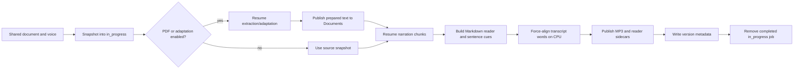

# Hilde architecture

Living description of the project as it currently exists. Keep synchronized with the code.

## Purpose and scope

Hilde has two interfaces over the same speech pipeline:

- `audiobook_tts.py` is a direct CLI for creating portable narrator references and narrating text into MP3 or WAV.
- `audiobook_tts_web.py` is a shared-library web server serving the Hilde browser app. It stores voices, documents, completed audiobooks, and resumable work under one server-owned root and exposes one-click document preparation plus narration.

The speech backend for each role is selected when the web server starts. Voice creation can use a local Qwen3-TTS VoiceDesign model or an OpenAI-compatible speech endpoint. Narration can use a local Qwen3-TTS Base model, that model distributed across local/SSH workers, or an OpenAI-compatible endpoint.

Current document preparation supports PDF, plain text, and Markdown. PDF pages are converted to Markdown. Optional OMP adaptation rewrites body paragraphs for spoken narration while omitting terminal bibliography sections.

Out of scope: EPUB extraction, CLI playback, built-in web authentication/authorization, and a durable multi-process queue. Audiobook submissions share one process-local worker scheduler. Direct public exposure is unsupported; deploy behind an authenticated, rate-limited TLS reverse proxy.

## Repository structure

| Path | Responsibility |
| --- | --- |
| `audiobook_tts.py` | CLI parsing, validation, voice persistence, chunking, local/SSH worker orchestration, OpenAI-compatible narration, batching with out-of-memory retries, and durable narration checkpoints. |
| `audiobook_tts_web.py` | Shared storage, single-page UI, document preparation, narration-worker scheduling, CPU forced word alignment, OMP integration, workflow orchestration, SSE progress, exactly indexed reader audio, serving and download. |
| `example_run.sh` | Example web-server launch: local Qwen3-TTS models, `~/AudiobookTTS`, port 8800 on every interface, and every GPU CUDA can open. Set its interpreter and model paths for your machine; extra arguments pass through. |
| `assets/hilde-dark.png` | Hilde logo: page header mark, browser favicon, and Apple touch icon. |
| `assets/zeki.jpg` | Small mark in the page footer's "by Zeki Works" signature. |
| `prompts/PAPER-AUDIO-BOOK.md` | Text-adaptation instructions for the OMP model. Each job reads them when it starts. |
| `voices/` | Stock voices: each a VoiceDesign reference clip reading the fixed preview passage, its transcript, and its prompt as `description.txt`. A new library starts with a copy; the CLI can use them directly with `--voice-dir`. |
| `test_audiobook_tts.py` | Dependency-light `unittest` regressions for persistence, storage/version rules, resume, unified workflows, events, document adaptation, endpoints, batching, voice/library catalogs, and preview rendering. |
| `requirements.txt` | Platform-neutral runtime dependencies. PyTorch/TorchAudio are installed separately for the target CPU/CUDA build. |
| `README.md` | User guide in four sections: Installation, Configuration (web server options, storage, models, workers, batch size, text adaptation, access), Web UI, and Command line. |
| `AGENTS.md` | Short standing instructions that coding agents load automatically; the details stay in this document. |

There is no package manifest. Both applications are run directly with Python.

## CLI architecture

### Commands

`build_parser()` defines:

- `create-voice`: generate one reference clip and persist it with the exact input passage and its voice description.
- `narrate`: split narration-ready text, clone one saved voice locally/across model workers or call one OpenAI-compatible voice, then assemble MP3/WAV output.

`check_mode()` enforces rules argparse cannot express:

- a local model is required unless `--server` is present;
- remote mode rejects local-inference flags rather than silently ignoring them;
- voice-design endpoints using models known to ignore `instructions` are rejected.

Heavy dependencies remain lazy imports. `--help`, endpoint parsing, and most validation do not load Torch or Qwen.

### Voice persistence

A saved local voice is:

```text
<voice-dir>/
├── reference.wav
├── transcript.txt
├── description.txt   voice description (--instruct), searched by the web UI
└── preview.wav       optional; the fixed preview passage rendered for older voices
```

`save_voice()` stages the clip, transcript, and description in a sibling directory. Without `--overwrite`, an existing destination is rejected. With it, the owned files are replaced: a replacement without a description removes the old `description.txt`, and every replacement removes a `preview.wav` rendered from the old audio. Unrelated files remain. `transcript.txt` is the exact UTF-8 passage used for generation and is written last as the commit marker.

`read_voice()` rejects empty transcripts and empty, non-mono, non-finite, or silent audio. These checks keep a persisted voice suitable for later prompt construction.

### Narration and output

`split_text()` prefers paragraph and sentence boundaries, then wraps oversized sentences and words. Chunk order is stable. Its sentence-chunk mode starts every sentence in a new chunk and is mandatory for the web reader.

`prepare_output()` validates the destination before model loading or remote calls:

- suffix must be `.mp3` or `.wav`;
- WAV subtype and MP3 compression flags must match the format;
- output cannot alias the input or saved voice files;
- the parent must already exist;
- an existing destination requires `--overwrite`.

Without `--resume-dir`, single-device local narration uses whole-book or fixed-size batches and writes the selected container directly. OpenAI-compatible narration sends one `POST {server}/audio/speech` request per chunk and requires all returned WAV chunks to keep one sample rate/channel layout. Multi-worker local/SSH narration requires `--resume-dir`.

### Durable narration resume

`--resume-dir` enables a checkpointed publication path:

1. `prepare_resume()` writes a manifest describing the text, chunk sequence, language, and voice/inference identity.
2. A changed identity removes incompatible `chunk-*.wav` files.
3. Existing checkpoints are accepted only when SoundFile can read them and they contain frames, a sample rate, and channels.
4. Each newly generated chunk is written to a temporary WAV and atomically renamed.
5. `assemble_checkpoints()` validates format consistency, encodes every checkpoint in order to a temporary final container, and atomically replaces the requested output.

Single-worker local identity includes the contents of `reference.wav` and `transcript.txt`, clone-model selector, device, dtype, attention backend, seed, and batch size. Distributed local identity adds the ordered worker topology. OpenAI-compatible identity includes endpoint, remote model, and remote voice ID. Container compression/subtype is intentionally not part of the waveform identity; checkpoints can be re-encoded into a different final container.

### Distributed narration workers

`--worker-device` adds persistent local model processes to the primary
`--device`; repeated `--ssh-worker` targets add persistent model processes
through passwordless OpenSSH. `narration_worker()` implements a private
newline-delimited JSON protocol. A worker emits readiness, accepts indexed
chunk batches, and returns base64-encoded FLOAT WAV data or a fatal error.

`_narrate_distributed()` starts every worker before dispatch, maintains one
in-flight batch per worker, and gives the next source-ordered batch to whichever
worker finishes first. The coordinator validates and atomically commits each
returned checkpoint immediately, then assembles all checkpoints in source
order. A failed worker aborts the run without discarding already committed
chunks.

An SSH transport stages the current script plus the saved `reference.wav` and
`transcript.txt` in a unique remote `/tmp/audiobook-tts-*` directory. The text
and WAV results cross the SSH process protocol; no shared filesystem is
required and the model is not copied. Targets use `BatchMode=yes` and therefore
must have an accepted host key, noninteractive authentication, a compatible
Python environment, and the configured Base model. Cleanup is best effort on
normal exit, failure, and stop. The remote machines are trusted with both the
narration text and saved voice.

Distributed batching is fixed: a positive `--batch-size` applies per worker and
zero becomes one chunk so fast workers can pull more work.

### Batching

Every clone call goes through `generate_clone_batch()`. A batch that raises a
CUDA out-of-memory error is repeated one chunk at a time; a single chunk that
still does not fit fails the run. Batch size is a manual setting because
throughput grows with it only until memory runs out. On an RTX PRO 6000 with
about 6 GiB free beside another model, one sentence per call ran at 1.6× real
time, two at 2.6×, and four or more ran out of memory, at about 0.7 GiB per
sentence on top of the 4 GiB model. The web app therefore defaults to 2.

## Web shared storage

`SharedStorage` owns a configurable root (`--storage-root`, default `~/AudiobookTTS`) and creates:

```text
<root>/
├── Voices/
├── Audiobooks/
│   ├── .readers/
│   └── .versions/
├── Documents/
└── in_progress/
```

Browser state contains only flat asset names. `safe_asset_name()` and `resolve_asset()` reject traversal and never accept an arbitrary filesystem path from a browser. File-serving and AirDrop paths must resolve inside the shared root.

`asset_catalog()` returns sorted shared voice and document names; the Listen page reads retained audiobooks from `GET /api/library`. Existing files are not migrated automatically when the root changes.

`prepare_library()` runs at startup. It creates the layout and, only when it
creates `Voices/`, copies in each stock voice from `STOCK_VOICES_PATH` whole:
staged under a hidden folder, hidden files skipped, then renamed into place. An
existing library is never reseeded, so a deleted stock voice stays deleted.

### Naming

- Saved voice: `Voices/<voice-name>/reference.wav` plus `transcript.txt`, with `description.txt` and an optional rendered `preview.wav`.
- Prepared document: `Documents/<input-stem>-narration.txt`.
- Final audiobook: `Audiobooks/<input-stem>-<voice-name>.mp3`.
- Unfinished workflow: `in_progress/<audiobook-output-stem>/`.
- Synchronized reader: content-addressed Markdown and timing JSON under
  `Audiobooks/.readers/`, referenced by the audiobook version record.

For remote narration, the remote server voice ID supplies `<voice-name>`.

### Versions and overwrite confirmation

`file_version()` hashes document bytes. A local voice version hashes both owned files and their names; descriptions and previews are not part of it. A remote voice version hashes endpoint, model, and voice ID.

After a successful audiobook run, `.versions/<output-name>.json` records the input and voice versions plus the committed synchronized-reader sidecars. `/api/run` returns HTTP 409 with `confirmation_required` only when:

- the target MP3 exists;
- its version record has the same input hash; and
- its version record has the same voice hash.

The browser then asks whether to overwrite and retries with `confirmed: true`. A changed input, changed voice, or output without matching metadata is replaced without another confirmation. Document uploads/downloads and voice creation also replace same-named assets.

## Canonical browser state

`normalize()` accepts tabs `audiobook` (Create), `voice` (Voices), and `player` (Listen) and rebuilds four known sections:

- `runtime`: dtype, attention, language, input encoding, seed;
- `voice`: remote design voice, name, description prompt, reference WAV subtype;
- `audiobook`: current Create step (`book`, `voice`, or `create`; anything else becomes `book`), remote clone voice or saved voice, document, URL plus optional download name, adaptation settings (model, local model server, and its type: `ollama`, `lm-studio`, or empty), and chunk, batch, and compression settings. The batch size defaults to 2; a state saved under schema 3 with that schema's default of 1 moves to 2 once;
- `player`: the audiobook open on Listen, so a refresh reopens it.

Normalized state is compressed into bounded, chunked, year-lived `HttpOnly; SameSite=Strict` cookies. TTS model paths/IDs, speech endpoints, credentials, worker devices/hosts, storage paths, and output paths are server-owned and never accepted from browser state.

## Document preparation

`PaperRun` performs extraction and optional adaptation inside a caller-provided durable directory for unified jobs. Its older standalone mode can still use a temporary directory.

### PDF extraction

PDF work is page-addressable:

1. a short-lived child obtains the page count;
2. one converter child writes each missing `pdf-pages/<page>.md` checkpoint;
3. extracted figures remain under `images/`;
4. page Markdown is joined into `document.md` in source order.

Existing page checkpoints are reported and reused. The converter uses `pymupdf4llm`; OCR and layout handling remain outside the long-lived HTTP process.

### Paragraph adaptation

After text extraction, `split_paper_paragraphs()` produces ordered nonempty
blocks. Paragraphs whose decoded content consists only of Unicode control or
format characters are discarded unless they contain a real table or image.
`omit_reference_sections()` removes standalone
References/Bibliography/Works Cited/Literature Cited/Reference List sections
while preserving inline attributions and recognized later appendices.

When adaptation is enabled:

- `paper_system_prompt()` combines the instructions in `prompts/PAPER-AUDIO-BOOK.md` with the transport contract;
- a rolling pool dispatches bounded consecutive paragraph batches through `omp`;
- compacted prior summaries provide bounded continuity context;
- referenced extracted figures become attachments for the relevant batch;
- malformed response payloads are retried up to the configured attempt limit;
- format-control-only narration paragraphs are removed, and an all-artifact
  response is retried;
- each successful batch is atomically stored in `paragraph-checkpoints/<start>-<end>.json`;
- completed batches may finish out of order, but narration and summaries commit in source order.

On restart, committed checkpoints populate the result buffer before only missing batches are submitted. With adaptation disabled, normalized body paragraphs are written directly.

`extraction.json` binds checkpoints to input bytes, adaptation toggle, OMP model/local endpoint, worker configuration, and prompt contents. A mismatched identity clears incompatible extraction state. A complete matching preparation is reused without conversion or OMP calls.

## Unified `AudiobookRun`

**Create audiobook** submits an `AudiobookRun` to the shared consumer queue:



At queue submission, source bytes and any local voice files are copied into a stage named by the job ID. Matching snapshots are reused; changed source/voice versions use a different stage. This prevents another client replacing a shared asset while the job waits or runs from changing that job's identity.

PDF extraction always runs. OMP adaptation is independently optional. Prepared text is copied to shared `Documents`, while narration reads the durable staged preparation so a concurrent document replacement cannot affect it.

Narration always invokes the CLI with `--resume-dir`, `--sentence-chunks`, and
`--overwrite` against a staged MP3. The web process uses completed WAV
checkpoints for exact sentence boundaries, combines narration with extracted
Markdown tables and embedded raster visuals, then aligns the known words in
each chunk with TorchAudio `MMS_FA` plus Uroman. Alignment is serialized through
one CPU model and stores integer source-sample boundaries. A failed chunk
produces partial word timing; failure to load the aligner leaves the exact
sentence timing usable. The reader sidecars and MP3 publish before the version
record, which is the commit marker. Failure or Stop leaves the stage; success
removes it.

`AudiobookRun.stop()` signals document workers, terminates converter/OMP children and the narration child, and closes the run with code 130. Restarting with the same assets/settings resumes from the durable state.

## Audiobook worker pool

`audiobook_job_id()` hashes exactly the document content version and voice
version. Filenames, browser identity, output names, and inference controls are
not part of the job identity. A submission matching a preparing, queued, or
running pair returns that existing record; the first submission owns its
labels, output path, and execution settings.

For a local narration model, `audiobook_consumers()` creates one worker
descriptor per CUDA GPU visible to the server process and appends passwordless
SSH workers configured at startup. `CUDA_VISIBLE_DEVICES` controls local
membership; repeated `--narration-ssh-worker` flags control remote membership.
Every HTTP submission requests the process-owned automatic pool and atomically
claims every currently idle compatible worker as one gang. Each worker then
dynamically pulls batches for that job; a second job waits when the first owns
the pool. OpenAI-compatible narration and local hosts without CUDA use one
fallback worker. The device probe counts GPUs after CUDA initialization: before
it, NVML also counts a GPU the runtime cannot open, and indexing that GPU would
drop the whole pool to one CPU worker. A skipped GPU shifts the later runtime
indexes, which are the ones narration children use.

Source and local voice assets are snapshotted before a record enters the
consumer queue. Voice generation is exclusive and requires no preparing,
waiting, or active audiobook. Active and pending records are process-local;
durable stages remain under `in_progress`, so resubmitting the same version pair
after restart resumes compatible extraction and narration checkpoints.

## Runs, events, and ETA

`Run` stores numbered event history and supports multiple SSE subscribers. Events include:

- `phase`: Extraction, Narration, or Voice creation;
- `progress`: completed/total units plus run and phase elapsed time;
- `activity`: adaptation work completed out of order and the next blocked paragraph;
- `log`: child output;
- `done`: code and published artifact.

`/api/events?job=<id>` honors `Last-Event-ID`, replays only missing history for
that job, and adds stream-time elapsed values. A page reload follows one active
run; the queue's **View** controls switch the progress panel between concurrent
runs, and polling follows another active job after the viewed one ends. If the
server restarted, the browser reports interruption and directs the user to
resubmit; durable audiobook work then resumes from its version-pair stage.

The page resets ETA at every phase boundary. It combines historical phase duration from browser `localStorage` with observed seconds per completed unit, renders a one-second countdown (`About 3m 10s left`), and shows `Estimating time…` or `Almost done…` when no useful numeric estimate exists. Narration progress is driven by committed `Checkpointed chunk N/T` lines, not request-start lines.

## UI contract

The browser app is **Hilde**. The Hilde logo (`assets/hilde-dark.png`) and
name head the page above a small "Audiobook Studio" tagline, and a small
**by Zeki Works** signature with `assets/zeki.jpg` closes it. The palette is
one charcoal ground, off-white text, one gray surface family, and one warm
orange accent reserved for the selected tab or voice, the primary action,
progress, and playback. Each view shows at most one primary (orange) button.

Three pages form an ARIA tablist of folder tabs on a baseline (Arrow, Home, and
End keys move between them). Inactive tabs stand slightly raised with a bevel;
the active tab is flush with an accent top edge and opens into the page below.
**Advanced** is a separate toggle at the right of the strip, hidden on
**Listen**:

- **Create** shows three steps, one open at a time; a finished step collapses
  to a summary with **Change**, and a later step opens only after the earlier
  ones are complete.
  1. **Add your book**: choose a document, upload a PDF/Markdown/text file, or
     add one under **Add from a link**; **Continue** downloads a link first.
     **Delete** beside the dropdown removes the chosen document.
  2. **Choose a voice**: the saved-voice dropdown with **Search voices** beside
     it (opens **Voices**) and a card previewing the chosen voice. A narration
     speech server takes a server voice ID instead.
  3. **Create audiobook**: optional text adaptation, then **Create audiobook**.

  A run this browser starts, reopens after a refresh, or chooses to view
  replaces the steps with four plain stages: Reading your document (PDF
  pages), Preparing the narration (adaptation paragraphs or reused text),
  Creating the audio (narration), and Finishing your audiobook (alignment),
  with progress, ETA, and **Stop**. Its outcome offers **Start listening**
  (opens the book on **Listen**) and **Download MP3**, both tied to that
  result even after the next queued run starts; a stopped run offers
  **Continue** and a failed one **Try again**, with its last log lines under
  **Technical details**. Both resubmit the reported job's book and voice,
  whatever the steps hold by then. **Start another audiobook** returns to the
  steps while the run continues behind a banner with **View progress**; a
  queued run that starts later never replaces steps being filled in, and a
  background run's outcome appears as a notice. An **In progress** list with
  View/Stop/Cancel appears whenever it holds a job other than the followed
  one. Focus moves to the heading of each card that replaces the steps.
- **Voices** is a compact table: Preview, Voice name, Prompt, and **Select**
  and **Delete** buttons, 50 rows at a time with **Show more**. The prompt is
  the VoiceDesign description
  saved as `description.txt`. Search reads prompts only: every typed word must
  begin a prompt word (AND, any order, case- and accent-insensitive, so `male`
  does not match `female`). One shared player previews in place, ignoring
  clips replaced before they start; **Select** makes the voice current and
  returns to Create with focus on the next step. **New voice** asks for a name
  and prompt only, and **Stop** cancels a creation without saving anything.
  Successful creation stays on Voices, shows the new voice's preview, and
  selects it for Create; users refine a narrator by adjusting the prompt and
  choosing **Replace voice**, which regenerates the same name.
- **Listen** is a compact table: Title, Duration, Source name, and **Listen**
  and **Delete** buttons, newest first, 50 rows at a time. Search reads titles
  only, with the same rules.
  Without audiobooks it shows a short explanation and **Create your first
  audiobook**. **Listen** opens the book view: title, narrator, duration,
  source, **Follow along**, **Download MP3**, the player, and the synchronized
  reader; **All audiobooks** returns to the table.

Every **Delete** asks for confirmation (`window.confirm`) and disables itself
while its request runs. Deleting the selected voice or document clears that
selection, so Create reopens the step that needs it, and deleting a voice just
created clears its result.

Buttons that start work disable themselves while their request is in flight,
so a double click starts one job or voice. A refresh restores the page, Create
step, selections, the book open on Listen, and a running job's progress. A
sync response older than a newer local change is ignored, and derived checks
apply only to the page they were computed for. The run log stays visible
below Create and Voices; it shows the fixed passage as
`<fixed preview passage>`.

Phones (up to 640 px) reduce the header to the logo and name and turn both
tables into list rows. On phones and coarse pointers every control is at least
44 px tall. Focus is always visible, and selection, step state, and errors
never rely on color alone (check marks, "Selected", ⚠ prefixes, and
visually hidden step states).

### Voice previews

Every voice created by the web UI reads `VOICE_REFERENCE_TEXT`, one fixed
passage defined once in `audiobook_tts_web.py`; the browser never sees or
sends it. That voice's `reference.wav` is its preview, so previews compare
pace, tone, and naturalness on the same words at similar length. A voice whose
transcript differs (created earlier, or by the CLI with other text) previews
`preview.wav` instead. `--render-voice-previews` narrates the fixed passage
with each such voice using the configured Base model and the default browser
runtime, stages each clip in the voice directory, renames it into place only
after a successful run, reports voices that failed, and exits. Until a voice
has one, **Voices** labels its preview as reading an older passage.
The stock voices read the fixed passage too, so changing `VOICE_REFERENCE_TEXT`
means designing them again; a test checks each one.

### Advanced and devices

**Advanced** shows **This server**: one live chip per narration worker (`GPU 0
idle`, `running`, or `reserved` during voice creation; the tooltip adds the
device and job) followed by the shared device description, and the narration
and voice-design models plus the device voice creation uses. It also holds
precision/attention tuning, language, encoding, and seed; narration
chunk/batch/MP3 settings on Create; OMP model/concurrency and a local
model server with its type while adaptation is on; and reference-WAV
encoding on Voices, kept because the
generated WAV is required for local cloning. Browser state contains no device
choice. Local audiobook jobs claim all currently idle local CUDA and
configured SSH workers; voice creation resolves automatically to the first
CUDA device, then MPS, then CPU. **Download MP3** retrieves an exact retained
audiobook name.

### Reader

The **Listen** reader renders narration-ready Markdown, including structurally
valid pipe tables and embedded PNG/JPEG/WebP/GIF visuals. Raw HTML is disabled.
Its audio controls stay pinned to the top of the screen while the text
scrolls. Newly generated audio has
exact integer-sample cues for every sentence and force-aligned word. The first
aligned word in each block becomes its sentence checkpoint, replacing legacy
length estimates whenever word timing exists.

Each sentence remains its own cued block, but the reader lays blocks out by
narration paragraph: the sentences of one paragraph flow as inline spans in a
shared `<p>` (or heading line), while lists, tables, and images stay blocks
attached to their sentence. New sidecars record each block's paragraph in a
`paragraphs` array; paragraph-era sidecars derive it from their original
paragraph blocks; sentence sidecars written before the array existed show one
sentence per paragraph. The playing sentence is tinted, its paragraph carries
the accent bar, and the current word is filled.

The reader player requests `/api/audio?name=...&container=mp4` first. Browsers
seek VBR MP3 through its coarse 100-entry Xing table and then report the
requested time while decoding audio from elsewhere (measured in Chrome: up to
±12 s on a 47-minute book, ±60 s on a 4-hour book, persisting until the next
seek). The MP4 wraps the unchanged MP3 frames in an exact sample table plus a
LAME-gapless edit list, so the media clock and the audio agree after every seek
and media time zero is the first cue sample. Browsers that cannot play MP3 in
MP4, or a file the indexer refuses, fall back to the plain MP3 source.

Clicking a word seeks to it, starting up to 0.1 s before its aligned onset but
never inside the previous word or sentence; clicking elsewhere in a sentence or
its attached visual seeks to its sentence cue. The upcoming word is highlighted
within the same lead.
While playing, the highlight follows the media clock every animation frame.
The sentence cue is authoritative over a disagreeing word cue, so a word
alignment error cannot outlive its sentence. Narration-ready visual descriptions
receive word cues, while attached table cells and image markup do not.
Visual-only and invisible-artifact intervals remain assigned to an adjacent
visible block for their full audio duration. **Follow narration** controls
auto-scrolling. Paragraph-era sidecars retain estimated sentence cues only when
word alignment is unavailable. Older MP3s without reader metadata remain
playable but have no synchronized text.

## HTTP routes

| Route | Behavior |
| --- | --- |
| `GET /` | Embedded HTML/CSS/JS page served with `Cache-Control: no-store` so a refresh cannot retain an obsolete player implementation. |
| `GET /api/state` | Normalized cookie state, derived validation/names, shared catalog, active-run list, queue, per-worker device descriptions and state, active model names, and non-sensitive capabilities. |
| `GET /api/jobs` | Active-run list, consumer state, and preparing/running/waiting audiobook records. |
| `POST /api/sync` | Normalize state, replace cookies, return derived state and shared catalog. |
| `POST /api/documents/upload?name=...` | Stream up to 64 MiB into shared Documents using atomic replacement. |
| `POST /api/documents/download` | Fetch a direct HTTP(S) PDF/text/Markdown URL; infer a safe filename and extension when omitted. |
| `POST /api/voices/delete`, `POST /api/documents/delete`, `POST /api/audiobooks/delete` | Delete one asset named by JSON `name` and return the shared catalog. A voice folder is renamed out of `Voices/` in one step before its files are removed; a linked voice or document loses only its link; the voice a running creation writes is refused with HTTP 409. An audiobook takes its version record, the reader files that record names, and older `<name>.<audio-hash>` reader files. A missing asset returns HTTP 404 with a fixed message; errors never name server paths. |
| `POST /api/run` | Start or enqueue an audiobook, deduplicating active version pairs; voice generation requires an empty queue. |
| `POST /api/stop`, `POST /api/jobs/cancel` | Stop all active work or cancel one active/waiting audiobook by job ID. |
| `GET /api/events?job=<id>` | Resumable SSE history and live events for the active or retained job. |
| `GET /api/voices` | Saved voices sorted by name, with whitespace-collapsed prompts (`description.txt`), whether the preview reads the fixed passage, and a preview version that changes when the clip is replaced. |
| `GET /api/voices/preview?name=...` | A voice's preview: `reference.wav` when its transcript is the fixed passage, else a rendered `preview.wav`, else the older reference clip. |
| `GET /api/library` | Retained audiobooks newest first with title (first top-level reader heading, else the document name), duration, source document, and narrator; entries are cached until the MP3 or its version record changes. |
| `GET /api/audio?name=...`, `GET /api/download?asset=...` | Serve a retained audiobook by exact asset name with exact byte ranges; download is an attachment. `container=mp4` serves the MP3 losslessly behind a cached, exactly indexed MP4 header, or HTTP 415 when its frames cannot be indexed. |
| `GET /api/reader?name=...` | Return sanitized rendered Markdown blocks with their paragraph index, plus validated sentence and optional word cues in source-audio samples for one completed audiobook. |
| `GET /api/paper/models` | OMP/default/local model catalog. |
| `GET /api/paper/openai/status`, `POST /api/paper/openai/login`, `POST /api/paper/openai/cancel` | Server-side OMP OpenAI device authorization. |
| `POST /api/paper/local/check` | Validate a local model server of the chosen type (`provider`: `ollama` or `lm-studio`) and refresh its catalog. The type is the user's choice, never detected. Ollama must answer `/api/version`: SGLang also answers Ollama's `/api/tags`, but OMP's Ollama client fails against it. OpenAI-compatible servers (SGLang, vLLM, LM Studio) list `/v1/models` and run through OMP's `lm-studio` provider. A job refuses a local model whose provider differs from the saved server type. |
| `POST /api/airdrop` | macOS-only sharing for a path inside shared storage. |

POST requests with a cross-origin `Origin` host are refused. This is CSRF hardening, not authentication. The default bind is `0.0.0.0`; use `--host 127.0.0.1` when the shared server must be local-only.

## Core invariants

- The browser never supplies model configuration, worker devices/hosts, storage paths, output paths, or arbitrary server paths.
- Reference audio and transcript move together and the transcript remains the exact generation passage.
- Every voice created by the web UI speaks `VOICE_REFERENCE_TEXT`; the browser never supplies the reference passage. A rendered `preview.wav` is published only after a successful render and is removed whenever its voice is replaced.
- A resumable narration never mixes checkpoints from different text/chunk/voice/inference identities.
- Public audiobook job identity contains only the document content version and voice version.
- Each narration worker is assigned to at most one audiobook at a time; one Auto audiobook may own several workers. Voice generation is exclusive.
- A resumable extraction never mixes pages or paragraph batches from different preparation identities.
- Shared source and local voice assets are snapshotted before work.
- Deletion removes only the named asset inside its library folder, never a link's target. Jobs already queued keep their snapshots, and the voice a running creation writes cannot be deleted.
- Prepared narration reads staged content, not a mutable shared copy.
- Final audiobook publication is atomic; a failed/stopped unified run does not publish a partial MP3.
- An `in_progress` stage is removed only after final output and version metadata are committed.
- Reader sidecars are published before their version record; the record names
  content-addressed files matching the current MP3.
- Reader word cues must reference a valid rendered block and remain within the
  committed audio duration; invalid sidecars are rejected rather than trusted
  by the browser.
- Reader blocks containing only invisible format controls are collapsed into an
  adjacent visible block without dropping their audio interval.
- Reader paragraph indexes start at zero and advance by at most one per block;
  a sidecar with any other grouping is rejected.
- Reader images are embedded only from validated raster files inside the
  staged document roots; server paths never reach browser markup.
- Exact reader seeking never re-encodes audio: the MP4 payload is the retained
  MP3's audio frames byte for byte, and its presentation duration equals the
  decoded sample count the reader cues index.
- Exact-version overwrite confirmation uses both input and voice versions.
- Automatic local audiobook work receives its complete worker set before the child coordinator starts.
- OpenAI-compatible narration never uploads local reference clips because that schema names a server-owned voice. SSH model workers do receive the staged reference and text.
- Browser-facing payloads describe local devices (runtime GPU index, device name, memory) and model directory names or IDs, but omit hostnames, SSH targets, speech-server URLs, script paths, model paths, and storage paths.

## Build, run, and verify

```bash
python audiobook_tts.py --help
python audiobook_tts.py create-voice --help
python audiobook_tts.py narrate --help

python audiobook_tts_web.py \
  --voice-design-model /path/to/VoiceDesign \
  --voice-clone-model /path/to/Base \
  --storage-root ~/AudiobookTTS \
  --port 8800
```

Add passwordless SSH workers to the web server with repeated
`--narration-ssh-worker USER@HOST`; configure their shared executable/model
using `--narration-ssh-python` and `--narration-ssh-model`.

Voices whose `transcript.txt` is not the fixed preview passage get a comparable
`preview.wav` from one pass, run while no audiobook is being made:

```bash
python audiobook_tts_web.py --voice-clone-model /path/to/Base \
  --storage-root ~/AudiobookTTS --render-voice-previews
```

```bash
python -m unittest -v test_audiobook_tts
```

The regression suite currently has 69 tests. It covers voice persistence
(including stale prompts and previews on replacement),
shared naming and versions, document/voice-only job identity, gang scheduling
across local and SSH workers, internal device pinning, FIFO scheduling and
deduplication, GPU enumeration when CUDA cannot open one device, public worker
and model configuration without hosts or paths, exact overwrite confirmation,
GPU-preferred resolution, extensionless document
URL inference, remote chunk reuse, resumable paragraph adaptation with bounded
concurrency and context and ordered commits, real PDF
extraction flowing directly into MP3 and an exact sentence reader through a
fake speech service, Listen-page, Create-step, and open-book persistence, the
fixed passage for every new voice, voice catalog preview comparability and
traversal refusal, preview refusal for voice folders linked from outside the
library, preview rendering that never publishes a failed clip, library
titles/durations/sources newest first and refreshed after a book is narrated
again, legacy sentence-cue conversion, persisted word cues,
Markdown table and embedded-image readers, lossless exactly indexed MP4 reader
audio with keep-alive byte ranges, safe retained-MP3 downloads,
job-specific SSE replay, cookie isolation, model configuration ownership,
endpoint normalization, local model servers of the chosen type, batches retried
one chunk at a time after running out of memory, the batch-size default for
older browser state, and deletion of voices (a link, never its target),
documents, and audiobooks with their reader files, refusing traversal, missing
assets, other origins, and a voice being created, stock voices that seed only a
new library, and stock voices that each preview the fixed passage with a
prompt. It does not load a Qwen model or require a GPU.

Runtime dependencies include Python, `soundfile`, NumPy, `pymupdf4llm`, RapidOCR, `markdown-it-py`, matched Torch/TorchAudio, and `qwen-tts`. OMP is required only when adaptation is selected. MP3 support depends on the installed SoundFile/libsndfile build.
