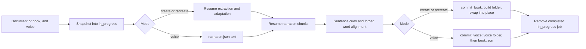

# Hilde architecture

Living description of the project as it currently exists. Keep synchronized with the code.

## Purpose and scope

Hilde has two interfaces over the same speech pipeline:

- `audiobook_tts.py` is a direct CLI for creating portable narrator references and narrating text into MP3 or WAV.
- `audiobook_tts_web.py` is a shared-library web server serving the Hilde browser app. It stores voices, documents, completed audiobooks, and resumable work under one server-owned root and exposes one-click document preparation plus narration.

The speech backend for each role is selected when the web server starts. Voice creation can use a local Qwen3-TTS VoiceDesign model or an OpenAI-compatible speech endpoint. Narration can use a local Qwen3-TTS Base model, that model distributed across local/SSH workers, or an OpenAI-compatible endpoint.

Current document preparation supports PDF, plain text, and Markdown. PDF pages are converted to Markdown. Optional adaptation by a language model rewrites body paragraphs for a listener: the author's prose stays, reader apparatus is left out, and dense material is tuned down. Tables of contents and terminal bibliography sections are removed with or without adaptation.

Out of scope: EPUB extraction, CLI playback, built-in web authentication/authorization, and a durable multi-process queue. Audiobook submissions share one process-local worker scheduler. Direct public exposure is unsupported; deploy behind an authenticated, rate-limited TLS reverse proxy.

## Repository structure

| Path | Responsibility |
| --- | --- |
| `audiobook_tts.py` | CLI parsing, validation, voice persistence, chunking, local/SSH worker orchestration, OpenAI-compatible narration, batching with out-of-memory retries, and durable narration checkpoints. |
| `audiobook_tts_web.py` | Shared storage, single-page UI, document preparation, narration-worker scheduling, CPU forced word alignment, the text-adaptation model clients with ChatGPT sign-in, the user's own Claude Code, and the Anthropic key, workflow orchestration, SSE progress, exactly indexed reader audio, serving and download. |
| `example_run.sh` | Example web-server launch: local Qwen3-TTS models, the default `User/` library, port 8800 on this machine only, and every GPU CUDA can open. Set its interpreter and model paths for your machine; extra arguments pass through, such as `--host 0.0.0.0` for other devices. |
| `assets/hilde-dark.png` | Hilde logo: page header mark, browser favicon, and Apple touch icon. |
| `assets/zeki.jpg` | Small mark in the page footer's "by Zeki Works" signature. |
| `prompts/PAPER-AUDIO-BOOK.md` | Text-adaptation instructions for the language model. Each job reads them when it starts. |
| `qa/` | The QA records reviewers and the fixer share: bug classes, findings, runs, papers, decisions, open questions, golden assertions per paper (`golden/<paper>.yaml`), and `qa.py` (`validate`, `check`, `report`, `next`). `qa/AGENTS.md` is its protocol. Golden checks run only here, on an output text; the app never reads `qa/`. Output texts under `qa/outputs/` stay out of git. |
| `voices/` | Stock voices: each a VoiceDesign reference clip reading the fixed preview passage, its transcript, and its prompt as `description.txt`. A new library starts with a copy; the CLI can use them directly with `--voice-dir`. |
| `User/` | The default library: voices, documents, audiobooks, and unfinished jobs. Created on first start and ignored by git. |
| `test_audiobook_tts.py` | Dependency-light `unittest` regressions for persistence, storage/version rules, resume, unified workflows, events, document adaptation, endpoints, batching, voice/library catalogs, and preview rendering. |
| `requirements.txt` | Platform-neutral runtime dependencies. PyTorch/TorchAudio are installed separately for the target CPU/CUDA build. |
| `install.sh` | POSIX installer run as `curl … \| sh`, all inside `main()` so a truncated download runs nothing. Needs only git and curl, never sudo: installs uv if missing (uv supplies Python 3.12), clones or fast-forwards `~/hilde` (`HILDE_HOME`), creates `.venv`, installs PyTorch 2.10 from the index matching the NVIDIA driver (580+ `cu130`, 525+ `cu126`, else `cpu`; `HILDE_TORCH` overrides; PyPI on macOS), then `requirements.txt`, checks the imports, and writes a `hilde` launcher to `~/.local/bin` (`HILDE_BIN_DIR`) that starts the web server with both Qwen3-TTS models by Hugging Face ID and `--allow-model-downloads`. Rerunning it updates; the library is untouched. **Set up** in **Add workers** pipes it to a node over SSH. |
| `README.md` | User guide: what Hilde does, how it reads a paper, measured results, a two-command quickstart through `install.sh`, known limitations, access and security, and License. Short summaries link to the guides below. |
| `docs/installation.md` | User guide to installing: the one-command installer and its settings, then by hand: environment, PyTorch/TorchAudio builds, dependencies, FlashAttention 2, and model downloads. |
| `docs/configuration.md` | User reference for the web server: starting it and its options, storage, speech models, narration workers, and batch size. |
| `docs/text-adaptation.md` | User guide to text adaptation: what it changes, models and providers, local servers and images, workers, and what the job log reports. |
| `docs/web-ui.md` | User guide to the page: creating an audiobook, the Listen reader, Voices, Advanced, and browser state. The README links to it. |
| `docs/command-line.md` | User guide to `audiobook_tts.py`: creating a voice, narrating, multiple GPUs, CPU, a speech server, and input and output. The README links to it. |
| `docs/ssh-workers.md` | User guide to narration workers on other machines: requirements, **Add workers** and `workers.yaml`, and the CLI form. The README links to it. |
| `docs/command-line-options.md` | User reference listing every `audiobook_tts.py` flag with its default. The README links to it. |
| `AGENTS.md` | Short standing instructions that coding agents load automatically; the details stay in this document. |

There is no package manifest. Both applications are run directly with Python.

## CLI architecture

### Commands

`build_parser()` defines:

- `create-voice`: generate one reference clip and persist it with the exact input passage and its voice description.
- `narrate`: split narration-ready text, clone one saved voice locally/across model workers or call one OpenAI-compatible voice, then assemble MP3/WAV output.

`check_mode()` enforces rules argparse cannot express:

- a local model is required unless `--server` is present;
- remote mode rejects local-inference flags rather than silently ignoring them;
- voice-design endpoints using models known to ignore `instructions` are rejected.

Heavy dependencies remain lazy imports. `--help`, endpoint parsing, and most validation do not load Torch or Qwen.

### Voice persistence

A saved local voice is:

```text
<voice-dir>/
├── reference.wav
├── transcript.txt
├── description.txt   voice description (--instruct), searched by the web UI
└── preview.wav       optional; the fixed preview passage rendered for older voices
```

`save_voice()` stages the clip, transcript, and description in a sibling directory. Without `--overwrite`, an existing destination is rejected. With it, `keep_voice_version()` first copies the voice being replaced (clip, transcript, and description; never a preview) into `<voice>/.versions/vN`, N one past the highest kept, and then the owned files are replaced: a replacement without a description removes the old `description.txt`, and every replacement removes a `preview.wav` rendered from the old audio. Unrelated files remain. `transcript.txt` is the exact UTF-8 passage used for generation and is written last as the commit marker.

`read_voice()` rejects empty transcripts and empty, non-mono, non-finite, or silent audio. These checks keep a persisted voice suitable for later prompt construction.

### Narration and output

`split_text()` prefers paragraph and sentence boundaries, then wraps oversized sentences and words. Chunk order is stable. Its sentence-chunk mode starts every sentence in a new chunk and is mandatory for the web reader.

`prepare_output()` validates the destination before model loading or remote calls:

- suffix must be `.mp3` or `.wav`;
- WAV subtype and MP3 compression flags must match the format;
- output cannot alias the input or saved voice files;
- the parent must already exist;
- an existing destination requires `--overwrite`.

Without `--resume-dir`, single-device local narration uses whole-book or fixed-size batches and writes the selected container directly. OpenAI-compatible narration sends one `POST {server}/audio/speech` request per chunk and requires all returned WAV chunks to keep one sample rate/channel layout. Multi-worker local/SSH narration requires `--resume-dir`.

`load_model()` imports Qwen through `import_qwen_tts()`, which captures file descriptors 1 and 2 during the import and replays them only if it fails. `qwen_tts` warns on import that flash-attn and the SoX executable are missing; Hilde needs neither (SoX serves only Qwen's 25 Hz tokenizer), and without the capture every worker would repeat both warnings in each job log.

### Durable narration resume

`--resume-dir` enables a checkpointed publication path:

1. `prepare_resume()` writes a manifest describing the text, chunk sequence, language, and voice/inference identity.
2. A changed identity removes incompatible `chunk-*.wav` files.
3. Existing checkpoints are accepted only when SoundFile can read them and they contain frames, a sample rate, and channels.
4. Each newly generated chunk is written to a temporary WAV and atomically renamed.
5. `assemble_checkpoints()` validates format consistency, encodes every checkpoint in order to a temporary final container, and atomically replaces the requested output. Joining tens of thousands of chunks takes minutes, so it prints `Joined chunk N/T` from 0, about 200 times over the book.

Single-worker local identity includes the contents of `reference.wav` and `transcript.txt`, clone-model selector, device, dtype, attention backend, seed, and batch size. Distributed local identity adds the ordered worker topology. OpenAI-compatible identity includes endpoint, remote model, and remote voice ID. Container compression/subtype is intentionally not part of the waveform identity; checkpoints can be re-encoded into a different final container.

### Distributed narration workers

`--worker-device` adds persistent local model processes to the primary
`--device`; repeated `--ssh-worker` values add persistent model processes
through passwordless OpenSSH, one per device of a machine. With
`--no-local-worker` only the SSH workers narrate and `--device` starts no
worker (`_local_worker_devices()`). `ssh_worker()`
parses `TARGET[,device=D][,python=P][,model=M]`; `check_distributed_mode()`
fills what a worker leaves out from `--ssh-device`, `--ssh-python`, and
`--ssh-model-path` (then `--clone-model-path`) and refuses a target and device
given twice. `narration_worker()` implements a private
newline-delimited JSON protocol. A worker emits readiness, accepts indexed
chunk batches, and returns base64-encoded FLOAT WAV data or a fatal error.

`_narrate_distributed()` starts SSH workers at once. A local CUDA worker starts
only when its GPU has at least `NARRATION_MIN_FREE_MIB` (6 GiB: the 4 GiB model
plus a batch) free. `GpuMemory` reads free memory with `nvidia-smi`, matched to
PyTorch device numbers by GPU UUID through a short-lived child; neither opens a
CUDA context, so measuring never takes memory from a full GPU. A GPU without
room waits and is measured again every `GPU_RECHECK_SECONDS` (60); a device
that cannot be measured (CPU, no `nvidia-smi`, no UUID) starts at once.

Each worker receives a batch as soon as it is ready, keeps one in flight, and
gets the next source-ordered batch when it finishes. Idle workers stay loaded
until the book is done, so returned chunks always find a worker. A local worker
whose error says `out of memory` (or cuBLAS/cuDNN `*_ALLOC_FAILED`) is dropped:
its in-flight batch returns to the front of the queue and its GPU waits as
above. Any other failure, including an SSH worker running out of memory, aborts
the run, as does having no worker alive and none waiting; committed chunks are
kept. The coordinator validates and atomically commits each returned
checkpoint immediately, then assembles all checkpoints in source order.
Waiting GPUs do not change the checkpoint identity, which names the configured
worker topology: the local devices and each SSH worker's target, device, and
model, but not its Python, which does not change the audio.

An SSH transport stages the current script plus the saved `reference.wav` and
`transcript.txt` in a unique remote `/tmp/audiobook-tts-*` directory. The text
and WAV results cross the SSH process protocol; no shared filesystem is
required and the model is not copied. Targets use `BatchMode=yes` and therefore
must have an accepted host key, noninteractive authentication, a compatible
Python environment, and the configured Base model. Cleanup is best effort on
normal exit, failure, and stop. The remote machines are trusted with both the
narration text and saved voice.

Distributed batching is fixed: a positive `--batch-size` applies per worker and
zero becomes one chunk so fast workers can pull more work.

### Batching

Every clone call goes through `generate_clone_batch()`. A batch that raises a
CUDA out-of-memory error is repeated one chunk at a time; a single chunk that
still does not fit fails a single-device run, and returns a distributed local
worker's batch to the queue. Batch size is a manual setting because
throughput grows with it only until memory runs out. On an RTX PRO 6000 with
about 6 GiB free beside another model, one sentence per call ran at 1.6× real
time, two at 2.6×, and four or more ran out of memory, at about 0.7 GiB per
sentence on top of the 4 GiB model. The web app therefore defaults to 2.

## Web shared storage

`SharedStorage` owns a configurable root (`--storage-root`, default `User/` in the project folder, ignored by git) and creates:

```text
<root>/
├── Voices/
├── Audiobooks/
│   └── <slug>--<hash12>/
│       ├── book.json
│       ├── source.<ext>
│       ├── narration.json
│       ├── reader.md
│       └── voices/<voice>/
│           ├── audio.mp3
│           └── timings.json
├── Documents/
├── in_progress/
│   └── voice-drafts/
└── workers.yaml
```

Browser state contains only flat asset names and book ids. `safe_asset_name()` and `resolve_asset()` reject traversal and never accept an arbitrary filesystem path from a browser; `read_book()` accepts only an id matching `BOOK_ID_PATTERN` and `voice_folder()` only a single safe component. File-serving and AirDrop paths must resolve inside the shared root.

`asset_catalog()` returns sorted shared voice and document names; the Listen page reads books from `GET /api/library`. Existing files are not migrated automatically when the root changes.

`prepare_library()` runs at startup. It creates the layout, runs `recover_books()` and `migrate_legacy_books()`, and, only when it
creates `Voices/`, copies in each stock voice from `STOCK_VOICES_PATH` whole:
staged under a hidden folder, hidden files skipped, then renamed into place. An
existing library is never reseeded, so a deleted stock voice stays deleted.

### Books

A book is one document's content made into narration once. Its identity is
the SHA-256 of the source bytes; the file name is not part of it. Its folder is
`book_id()`: `book_slug()` of the title (lowercase ASCII words joined by
hyphens, at most 60 characters, `book` when none) then `--` and the first 12
hexadecimal digits of the hash. `book_for_source()` finds a book by that suffix
and the full hash in `book.json`.

- `book.json`: `schema` (`BOOK_SCHEMA` 1, the layout of this file),
  `source_sha256`, `title`, `source_filenames`
  (every name the content came under), `source_file` (`source.<ext>`, or
  `null` for a migrated book), `created_at`, `updated_at`, `hilde_version`
  (`HILDE_VERSION`), `git_commit` (`git rev-parse HEAD` read once as the
  server starts, so it names the code that made the book even when the
  checkout moves on while the server runs, or `null` outside a
  checkout), `prompt_hash` (the SHA-256 of the system prompt, `null` without
  adaptation), `schema_version` (`EXTRACTION_SCHEMA`, the paragraph-selection
  rules the text was made under; unrelated to `schema`), `model`, `adapted`,
  `chunk_max_chars` (the chunk size its reader splits the text at), `prose`
  (`adaptation_fidelity()`), `seconds` for reading and adapting, and
  `narration_sha256`, the SHA-256 of `narration.json`'s bytes. `voices` lists
  each voice: `name`, `created_at`, `narration_sha256` (the text it read),
  `status` (`ready`, or `stale` once the book's text changed), `voice_version`,
  `audio_sha256`, `duration`, and its `seconds` for narrating and aligning.
  A migrated book also has `migrated_from`, `legacy_names` (its earlier MP3
  names), and, until it first plays, `migration_backup`.
- `narration.json` (`schema` 1): `original_view` (whether passages map onto
  the reader's paragraphs) and `passages`, one per adaptation batch, or per
  paragraph without adaptation: `id`, `type` (`body`, `heading`, `figure`,
  `table`, `equation`, or `footnote` or `caption` for a passage of only those),
  `page`, `text` (what is read aloud; empty for a batch left out),
  `original_text`, `unchanged`, `paragraphs` (`[first, last]` reader
  paragraphs), and `sources`, the author's paragraphs it came from, each
  `{type, page, text}` with type `body`, `heading`, `figure`, `table`,
  `equation`, `footnote`, or `caption`. The model narrates a footnote and a
  caption inside the passage that cites or carries it, so they are typed as
  sources. `_visual_type()` names a picture from its caption, a PDF table's
  image name, or panel titles; an uncaptioned picture is an equation.
  `narration_text()` joins the passages' text: exactly what the first voice
  read and every later voice reads.
- `reader.md` is the follow-along view: block-marked Markdown with pictures
  embedded. Its blocks are the sentences of the narration's paragraphs, so
  any voice's timings map onto it.
- `voices/<voice>/audio.mp3` and `timings.json` (the reader sync of schema
  1–3: sample rate, duration, block paragraphs, sentence cues, word cues).
  A voice's timings are never paired with another voice's audio.

`commit_book()` publishes a book with one voice: it writes everything into a
hidden `Audiobooks/.build-<random>` folder, `book.json` last, and
`swap_into_place()` renames it to the book's folder. A book of the same content
keeps its folder name, `created_at`, and file names; its other voices are
hard-linked into the new folder, `ready` when they read the same
`narration_sha256` and `stale` otherwise. The old folder steps aside as
`.replaced-<id>-<random>` before the new one is renamed in, so a crash between
the renames leaves both, and `recover_books()` at the next start puts the old
one back and removes `.build-` and `.trash-` folders, at the top level and in
each book's `voices/`. `commit_voice()` publishes one voice the same way inside
`voices/` and then rewrites `book.json`; it refuses when the book's
`narration_sha256` changed since the job started. Commits hold `_BOOK_LOCK`.
`delete_book()` renames the folder to `.trash-<random>` and removes it.

`migrate_legacy_books()` moves the earlier layout (`Audiobooks/<name>.mp3`,
`.versions/<name>.json`, `.readers/<name>.<hash>.md|json`) into book folders
without calling any model. MP3s of the same `input_version` become voices of
one book, newest first: the newest one's reader becomes `reader.md`, and a
voice whose reader differs is `stale`. An MP3 without a record becomes a book
keyed by its own hash with no source hash or text. `_legacy_narration()`
rebuilds `narration.json` from the `Documents/<stem>-narration.txt` the job
stored, only when it splits into exactly the reader's blocks and cue count at
some chunk size (500 first), and from the sidecar's `originals`; otherwise the
book plays but has no text for a new voice. Audio is hard-linked; the earlier
files move to `Audiobooks/.backup/<id>/` and stay until the book's audio is
first served (`release_migration_backup()`). The empty `.versions` and
`.readers` folders go. Rerunning finishes a migration a crash interrupted.

### Naming

- Saved voice: `Voices/<voice-name>/reference.wav` plus `transcript.txt`, with `description.txt`, an optional rendered `preview.wav`, and the versions it replaced in `.versions/vN/`. Job snapshots copy only `reference.wav` and `transcript.txt`.
- Book: `Audiobooks/<slug>--<hash12>/`, as above. A voice's download is named
  `<document-stem>-<voice-name>.mp3` (`narration_output_name()`).
- Unfinished workflow: `in_progress/<job-id>/`.
- Voice draft: `in_progress/voice-drafts/<id>/`, a clip **Listen** made that
  **Save** stores under a voice name. Listen keeps only the newest ten drafts.
- Workers: `workers.yaml`, a `nodes:` list of `host`, `python`, `model`, and
  `devices` (`cuda:N`, `mps`, or `cpu`) and an optional `local_off:` list of
  this machine's devices that do not narrate, with a comment header, written
  atomically by `write_workers()` when a node is added or removed or a local
  device is turned off or on, and read at startup by `read_workers()`.

For remote narration, the remote server voice ID supplies `<voice-name>`.

### Versions and confirmation

`file_version()` hashes document bytes; `cached_file_version()` remembers the hash while a file's size and modification time stay the same. A local voice version hashes both owned files and their names; descriptions and previews are not part of it. A remote voice version hashes endpoint, model, and voice ID.

`/api/run` returns HTTP 409 with `confirmation_required` when a new voice
would remake a voice the book already has `ready` with the same voice
version, and when Create names a document already made into a book that has
no text of its own (a migrated book without one), since a new voice then
needs the text written again. The browser asks and retries with
`confirmed: true`.

## Canonical browser state

`normalize()` accepts tabs `audiobook` (Create), `voice` (Voices), and `player` (Listen) and rebuilds four known sections:

- `runtime`: dtype, attention, language, input encoding, seed;
- `voice`: remote design voice, name, description prompt, reference WAV subtype;
- `audiobook`: current Create step (`book`, `voice`, or `create`; anything else becomes `book`), remote clone voice or saved voice, document, URL plus optional download name, adaptation settings (model, local model server, its type: `ollama`, `lm-studio`, or empty, and `local_vision`, whether its model sees images, true only when stored as `true`), and chunk, batch, and compression settings. The batch size defaults to 2; a state saved under schema 3 with that schema's default of 1 moves to 2 once;
- `player`: the book open on Listen and the voice playing, so a refresh reopens them. A book name from before book folders is an earlier MP3 name; the page maps it through the library's `legacy_names` to its book and voice.

Normalized state is compressed into bounded, chunked, year-lived `HttpOnly; SameSite=Strict` cookies. TTS model paths/IDs, speech endpoints, credentials, worker devices/hosts, storage paths, and output paths are server-owned and never accepted from browser state.

## Document preparation

`PaperRun` performs extraction and optional adaptation inside a caller-provided durable directory for unified jobs. Its older standalone mode can still use a temporary directory.

### PDF extraction

PDF work is page-addressable:

1. a short-lived child (`_PDF_OVERVIEW`) obtains the page count and the first
   page's title: its largest horizontal text in the top half, when that is at
   least 1.3 times the body size. An arXiv stamp runs up the margin in larger
   type, and small capitals mix sizes within a line, so whole lines holding the
   largest size are read. When the metadata title has the same words, its
   spelling wins over capitals. `pymupdf4llm`'s layout model can take a first
   page's title for a running header, which `header=False` drops, so
   `with_title_heading()` heads page one with the title, turns a paragraph
   that is only the title into the heading, and leaves a title found anywhere
   else on the page alone rather than read it twice; the log says when it
   restored one. The child also returns every horizontal line of the first
   page's top half with its box and whether it is bold. Extraction runs a row
   of author columns together, names first and then their affiliations, so a
   model must guess who works where; `pair_authors()` pairs each bold name
   with the lines right under it in its column, up to an email, and
   `with_author_affiliations()` rewrites such a row as "**name**, affiliation;
   …", footnote marks kept on each name. It pairs nothing when affiliations
   start with a number or mark (a numbered list, matched by those marks), when
   a row has a name with nothing under it (one line spans several names), or
   when fewer than two affiliations were found, and it rewrites a paragraph
   only when, beyond the names, it holds exactly those affiliations' words and
   emails, so names printed apart from their affiliations are not given them
   twice. The log counts the authors paired;
2. one converter child writes each missing `pdf-pages/<page>.md` checkpoint;
3. extracted figures remain under `images/`, linked as `images/<file>`: the
   converter runs from the extraction folder because `pymupdf4llm` links
   images relative to its working directory, and the reader and figure
   attachments resolve links against that folder. The converter asks for
   `page_chunks`, whose `page_boxes` give each table's box and its span in
   the page Markdown. Cells rebuilt from the layout split words across
   columns ("BL|EU") and carry stray emphasis and tags, so each table becomes
   ``, its whole caption as the
   label screen readers announce (`Table` without one), cut from its box at
   200 dpi, followed by its cells between picture-text markers: kinds `image`
   and `labels`, the same parts as a figure, so the reader shows the table as
   printed and the model gets the picture and the cells. `caption_chains()`
   finds the caption boxes directly above and below each table; a box the
   layout files as body `text` counts when it opens a caption ("Table 6:",
   `TABLE_CAPTION`), never a sentence about the table ("Table 5 lists…").
   `table_captions()` then gives each table one: a caption between a table and
   anything else is that table's, above before below, and one between two
   tables, as Table 1's sits over Table 2 when captions are printed below
   them (BERT), goes to whichever has none of its own, the nearer if both.
   No caption is used twice, and a caption box that opens another kind of
   caption (`OTHER_CAPTION`: "Figure 1:", "Algorithm 2:") is never a table's,
   as BERT's Figure 1 caption sits right above its Table 1.
   A listing set in a typewriter font (a program, a prompt, a skill file)
   comes out of the layout as many boxes, one per paragraph or list item,
   with a list item started wherever a line wraps and the font's spaces
   lost. `listing_runs()` finds each run of consecutive text, list-item,
   heading, or code boxes whose characters are at least 80% monospace (the
   span's monospace flag or a typewriter font name), and `listing_text()`
   rewrites it as one fenced block from the page's own lines in the
   layout's reading order: a box printed wholly above the lines gathered so
   far, where a listing goes on at the head of the next column, starts a
   section with its own left edge. Pieces of one printed row are joined in
   order, indentation is kept in characters, a row's second drawing as
   scattered glyphs over the first is dropped, and no blank line is left
   inside, so the listing stays one paragraph. An equation the layout cuts
   out as a picture (a `formula` box whose Markdown is a bare image) keeps
   the page's own text of that box behind the picture as its picture text,
   which ends with the number printed beside it, "(3)", taken from the same
   line to its right when the box leaves it out; a model that reads no images
   then knows what the equation says, and code names its description by that
   number and no other (`label_equation()`). Table, equation, and listing replacements are applied from
   the end of the page;
4. `join_pdf_pages()` joins the page Markdown into `document.md` in source
   order, mending what page breaks split. A page break always ends a
   paragraph, and the model sees each batch without the narration before it,
   so a sentence left in halves could never be repaired later. When a page's
   last prose paragraph ends without `. ? ! : ;` and the next page's first
   prose paragraph continues it (`_continues_sentence()`: it starts in
   lowercase, or the first half stops on a word no sentence ends on, per
   `DANGLING_END_PATTERN`, such as "for", "and", or "via", and the second
   starts with a letter or digit), the halves become one paragraph; a
   word the break hyphenated loses its hyphen unless the document spells it
   hyphenated elsewhere ("self-attention"). Footnotes, page numbers, and
   figures or tables between the halves are skipped over and follow the joined
   paragraph. A heading ends the search, except a figure's panel title (an
   unnumbered heading directly above an image, or between a figure's parts
   and its caption) and a page's first line read as a heading when it starts
   in lowercase. Within a page, `_rejoin_cut_sentences()` does the same for a
   figure, table, or footnote that cuts a sentence, as a float placed
   mid-column does. Either way `_interrupts_sentence()` requires what sits
   between the halves to be footnotes, page furniture, or a figure or table
   with its caption: an image without a caption is usually an equation
   printed as a picture ("the complexity is [equation] where …") and stays
   inside its sentence; `paper_batches()` then sends it with both halves.
   Captions are recognized as "Figure 2:", "Table 4.",
   or "Figure 1 | …". A caption broken above its table or figure is mended
   too. A sentence goes on behind a code mark (`` `test_normal` tasks``
   continues in lowercase). No sentence is joined into or onto a fenced
   listing (`_is_listing()`), and `_merge_listings()` makes a listing that a
   page break, footnote, or figure or table cut into one again, with what
   cut it following, so the whole listing reaches the model in one request.
   Last, `_place_after_mentions()` moves each numbered figure or table
   printed before the paragraph that first mentions it ("Figure 3(b)", "Figs.
   2 and 3", "Tables 1–4"), on its own page or the next, to follow that
   paragraph, so a description never comes before the author introduces its
   figure; one already after its first mention, or mentioned only pages away,
   stays. `_place_footnotes()`, which runs first, moves each footnote
   (`_footnote_marker()`: a number glued to its first word, "4To
   illustrate", or a symbol, "_†_ Work performed") to follow the nearest
   earlier paragraph on its page or the one before whose superscripts carry
   that marker (`_cited_markers()`: "<sup>4</sup>", "<sup>_∗†_</sup>" as ∗
   and †), so it is no longer read where the page printed it. A note cited by
   that paragraph alone comes first and one it shares with earlier paragraphs
   after, so the last author's affiliation note follows the name before the
   equal-contribution note every author line cites; and
   `paper_batches()` sends it in one request with that paragraph, where the
   prompt has it read right after the citing sentence, naming whom or what it
   is about. The job log counts the rejoined sentences and the moved figures,
   tables, and footnotes; once one note of a paragraph is out of place, the
   notes after it count as moved too. `join_pdf_pages()` also returns the
   page each block of
   `document.md` starts on, which
   `convert_pdf()` stores as `document-pages.json` (`{"pages": [...]}`); a
   rejoined sentence keeps the earlier page, and a moved figure or footnote its own.
   `narrated_source_pages()` maps them onto the narrated paragraphs for the
   reader, and returns nothing when the record does not describe the document.

Existing page checkpoints are reported and reused. The converter uses `pymupdf4llm`; OCR and layout handling remain outside the long-lived HTTP process. `pymupdf4llm` writes OCR text onto the page before it renders figures, so the converter hands it an OCR function whose text is inserted invisibly (render mode 3): the text is still extracted, including a figure's picture text, but figures render as the PDF draws them instead of with every OCR-read label printed a second time.

### Paragraph adaptation

After text extraction, `narrated_source_paragraphs()` returns the paragraphs a
narration covers. `split_paper_paragraphs()` produces ordered nonempty blocks.
Paragraphs whose decoded content consists only of Unicode control or format
characters are discarded unless they contain a real table or image. Then two
kinds of section are left out:

- a table of contents: a heading such as Contents, Table of Contents, or List
  of Figures, together with the paragraphs after it whose lines mostly end in a
  page number (after dot leaders, in a table's last cell, or in roman front
  matter). The first `#` heading or prose paragraph ends it, so a numbered
  heading such as "Chapter 1" stays. A Contents heading over prose names a real
  section and stays;
- standalone References/Bibliography/Works Cited/Literature Cited/Reference
  List sections, while inline attributions and later sections stay. The first
  `#` heading ends one, since entries are never `#` headings, and so does a
  recognized later title such as Acknowledgements or Appendix. PDF extraction
  can run a bold references title into the paragraph before it and the first
  entry (`… inspiration. **References** [1] Ba, …`);
  `_split_run_in_reference_title()` splits it out first when it starts the
  paragraph, a line, or a sentence and what follows does not continue one.

Adaptation checkpoints and the reader both number paragraphs in this list, so
both take it from this one function. Any change to it, to `join_pdf_pages()`,
or to `paper_batches()` bumps the extraction identity's `schema`.

When adaptation is enabled:

- `paper_system_prompt()` combines the instructions in `prompts/PAPER-AUDIO-BOOK.md` with the transport contract. The instructions put the listener first: reader apparatus (contents and section lists, roadmap sentences that announce later sections even without numbers, numbered cross-references except a figure's or table's own number, page furniture, citation machinery) is left out; headings keep the paper's own numbers and appendix letters as printed, one rule for every heading, never "Part" or "Section" added; tables (keeping the values that bound the comparison and the caption's caveats), formulas and notation (nested operations as steps, innermost first), long lists, runs of numbers, figures, and code are tuned down to their point; operations and sizes stay exact wherever math is spoken, the author's sentences included ("one over the square root of d k"); a description of a figure, table, or standalone equation opens with a spoken cue that names it ("Figure 2 shows…", "The equation says…"), numbered only when the page gives the number; the author's prose stays word for word, every quantity and every footnote statement included, in the author's voice;
- `paper_batches()` plans consecutive paragraph batches of up to **Paragraphs per worker**, but never splits a figure or table: its panel titles, images, the labels read from inside it, and its caption, above or below, are one unit, so one request describes it once, knowing its caption. A captioned figure or table (`visual_label()` names it by its caption, "Table 3") is a batch of its own, never merged with the prose around it, so its narration is its description alone: one figure or table passage in `narration.json`. Titled images without a caption, such as labelled equations, stay separate units, except an uncaptioned image between the halves of a sentence (`_continues_sentence()`), usually an equation printed as a picture: it joins both halves in one unit, so the model reads the sentence through with the equation in words instead of describing it between the halves. A rolling pool dispatches the batches to the chosen model, and each request's image attachments are the figures its paragraphs link;
- `model_paragraphs()` gives the model each paragraph as it should see it. Extraction writes a panel title as a heading, so requests send it as `Panel title: …`; otherwise the model reads it out as a section of its own. A heading the paper numbers (`numbered_heading()`: `NUMBERED_HEADING_PATTERN`, "4 Why Self-Attention", "3.1. A Regularization View", "B. Baseline Methods", "II. Results"; a lone capital needs its period, so "A Short Paper" is a title) is a batch of its own that never reaches the model: its checkpoint is the heading's words as printed, so every heading of a book follows one rule. A model rendered RRSI's printed "1. Introduction", "B. Baseline Methods", and "C. Method Details" as "1 Introduction", "Appendix B. Baseline Methods", and "Appendix C Method Details" in one run. Unnumbered headings still go to the model;
- prose batches carry the compacted summaries of earlier batches for continuity; a batch that is only a figure, table, or equation (`_describes_visual()`) goes alone, with neither (`paper_request()` with no summaries), and is described from what it carries: its caption, labels or cells, and picture. Summaries are model-written, so with them any earlier difference changed every later description; alone, a description's request is the same on every run. Quoting the author's paragraphs about the figure instead was tried and dropped: the model read them out in the description, sometimes in place of it. `defined_acronyms()` lists the acronyms the author spelled out ("Wall Street Journal (WSJ)", checked letter by letter against the words before it) in the paragraphs before each batch, computed from the source so it does not depend on which batches finish first; the prompt expands an acronym only where the author does, once;
- `reference_entries()` reads the numbered reference list from the whole source, before it is left out: each entry that opens a paragraph, follows another inside one, or follows the References heading extraction ran it into, as every author's surname, with at least three entries. `resolve_citations()` then settles each numbered citation in a request in code. Citations joined by "and" or a comma (`CITATION_CHAIN_JOIN`) are one chain, so "such as [17, 18] and [9]" is decided once. A chain the sentence needs (`CITATION_NEEDED_BEFORE`: after "similar to", "as in", "following", or opening a sentence) becomes whom it cites (`cited_as()`): one work its authors, "Press and Wolf" or "Ba and colleagues"; several their first authors, "Kalchbrenner and Gehring", "Wu, Bahdanau, and Gehring"; a work the list lacks is "earlier work", left out beside named ones. Any other chain, a parenthetical "networks [13]", is removed, as the prompt removes citation numbers. Handing the model "[Hochreiter and Schmidhuber, 1997]" made it read such brackets aloud, years and all; settled, it never guesses whom "[30]" means and never reads a parenthetical source;
- referenced extracted figures become image inputs for OpenAI and Claude models, and for a local model when the browser's `local_vision` is set (**This model sees images** in Add local); otherwise a local server receives only their extracted text, since it may run a text-only model;
- malformed response payloads are retried up to the configured attempt limit, and a request whose connection drops or is refused (`ModelConnectionError`, from `PaperRun.model_stream()`) is sent again after 1, 2, 4, then 8 seconds, each named in the log, before the job fails; a stream silent for `MODEL_STREAM_TIMEOUT` is not, since it would only stall again;
- a batch that is entirely excluded material, such as reference entries that
  extraction did not place under a standalone heading, a contents list the
  filter did not catch, or a bare image the model cannot describe, returns an
  empty NARRATION with a nonempty SUMMARY;
  it adds no text, the log names it with that summary, and the reader shows
  its visuals after the text before it;
- format-control-only narration paragraphs are removed;
- a batch made only of a figure, table, or equation (with its labels or caption) whose narration names none of them (`VISUAL_CUE_PATTERN`) in its first twelve words is named in the log; the job goes on, since a listener would otherwise hear no border between the author's text and the description;
- a batch of the author's prose (`TEXT_KINDS`) is scored by `prose_kept()`: the share of its words of four letters or more (`CONTENT_WORD_PATTERN`, any script) its narration still contains, after citation marks, superscripts, and links are set aside. Passages under `PROSE_KEPT_MIN_WORDS` are not judged; one under `PROSE_KEPT_LOW` (80%) is named in the log with its missing words, and the job goes on. A passage the model left out whole is not scored: the log already names it with the model's reason, and it is usually apparatus, such as a reference entry extraction glued to the text. The score catches dropped wording, not changed meaning or added claims. Once adaptation ends, or when a finished adaptation is reused, `adaptation_fidelity()` summarizes the saved checkpoints (narrated passages judged, how many kept at least 95%, how many fell under 80%, the lowest, and how many were left out whole) into the log and the audiobook's record;
- an equation's description is named in code before its checkpoint is written, when its picture text is math (holds "="): `label_equation()` makes the opening cue the name the paper prints, "Equation 3" for one printed with "(3)" (`printed_equation_numbers()`), "Equations 4 and 5" for two, "The equation" for one printed without, whatever the model called it ("Equation 6", "Eq. 6", "Equation six", "Figure 4"). Further on, an equation number the paper prints nowhere becomes that name too, in sentence case, and "the figure" or "the formula" becomes "the equation"; a real reference, "Figure 2" or "Equation 1" the paper prints, stays. The model, told the number, still wrote "Equation 6" for an unnumbered equation, and going alone it called four of five equations "Figure N";
- `grounding_problems()` names in the log what a batch's narration states that its source does not. A name its own request never mentions: any surname of a reference-list author or of the paper's own authors (`author_surnames()`: bold names on the first page, before the abstract), however the narration puts it ("Vaswani et al.", "used by Vaswani"), and any name it credits work to ("Press and Wolf", "Vaswani and others": `ATTRIBUTION_PATTERN`), case aside, so "Encoder and Decoder" passes beside "encoder"; a name the paper prints elsewhere, as "Vaswani" in the author block, does not excuse it. In a description, a number of two or more digits or a decimal that its source does not print, a printed number rounded allowed (a whole number opening a printed whole number counts, for powers extraction runs together, but "41.8" never vouches for "41"). It only points at a passage worth a look: the narration is kept as written, and nothing in it mentions the check;
- each successful batch is atomically stored in `paragraph-checkpoints/<start>-<end>.json`;
- completed batches may finish out of order, but narration and summaries commit in source order.

On restart, committed checkpoints populate the result buffer before only missing batches are submitted. With adaptation disabled, normalized body paragraphs are written directly.

The web server calls the model itself; `PaperRun.model_response()` routes by the model selector's provider:

- `openai-codex/<model>` streams a Responses request to the ChatGPT Codex backend (`CHATGPT_CODEX_URL/responses`, `store: false`) with the system prompt as `instructions` and the batch plus figures as input. `openai_model_names()` lists the signed-in account's models from `CHATGPT_CODEX_URL/models` in OpenAI's priority order, without hidden ones. The backend fails requests intermittently, both with an HTTP status and with an error event inside a stream it had accepted ("Unable to verify model access right now. Please retry."). A status in `RETRYABLE_STATUSES`, or an error event whose code is in `OPENAI_BUSY_CODES` or whose message asks for a retry, is asked again up to `MODEL_RETRIES` times after `_retry_delay()`: the `retry-after` (at most 60 seconds), else 1, 2, 4, then 8 seconds. Stop cuts the wait short. Other refusals fail at once.
- `anthropic/<model>` streams `POST /v1/messages` to Anthropic with the API key, the system prompt as `system`, and the batch plus figures as base64 image blocks; only `text_delta` events form the answer, never the thinking recent Claude models always do first. `max_tokens` is `ANTHROPIC_MAX_TOKENS` (32,000): every model Anthropic still serves accepts it, thinking counts toward it, and Anthropic's rate limit counts only the tokens produced. A status in `RETRYABLE_STATUSES` (429, 500, 502, 503, 504, or 529) before the stream starts is asked again up to `MODEL_RETRIES` times after `_retry_delay()`, and Stop cuts the wait short; a response that ends at `max_tokens` fails with advice to lower **Paragraphs per worker**. `anthropic_model_names()` lists the key's models from `/v1/models`, newest first.
- `claude-code/<alias>` (`sonnet`, `opus`, `haiku`: `CLAUDE_CODE_MODELS`) runs the user's own, unmodified Claude Code for each batch through `PaperRun.run_child()`, so Stop terminates it: `claude -p --model <alias> --system-prompt <prompt> --tools "" --strict-mcp-config --disable-slash-commands --no-session-persistence` with stream-json input and output (`claude_code_request()`). The batch goes in as one user message whose content is `_claude_content()`, the same text and base64 image blocks the Anthropic API gets; the answer is the final `result` event, and an error result, such as a plan's usage limit, fails the job with Claude Code's own text (`claude_code_answer()`). It runs in `~/.hilde`, outside the project, so no instructions file joins the prompt. Never `--bare`: that mode reads only `ANTHROPIC_API_KEY` and skips the subscription sign-in. `claude_code_command()` finds `claude` on PATH or where its installer puts it (`CLAUDE_CODE_CANDIDATES`), and `claude_code_status()` asks `claude auth status` whether it is signed in; Hilde never reads Claude Code's credentials.
- `ollama/<model>` and `lm-studio/<model>` stream `POST /v1/chat/completions` to the saved local server at `temperature` `LOCAL_MODEL_TEMPERATURE` (0.2); left to the server, a model samples at its own default, often 1.0, and the same paper reads differently on every run. Adapting the Attention paper twice with Mistral Small 4 kept 48 of 92 prose batches word for word at 0.2 against 31 at 1.0, with the same tone, and 0 was no steadier. Only `content` deltas form the answer, never reasoning. The user message is plain text, or, when `local_vision` is set and the batch links figures, OpenAI-style content parts with each figure as an `image_url` data URL, which Ollama, vLLM, SGLang, and LM Studio accept. Whether the model sees images is the user's choice, never detected: a 400 from a text-only model fails the job with advice to clear that setting.
- Each request is a `ModelStream` registered with the run. Stop shuts down its socket, which wakes a blocked read at once, including a request a busy server has not started answering.
- A job without a chosen model resolves `paper_model_catalog()`'s default at start and records that concrete model in its identity. When the browser has added a local server, the default is its first model; while that server does not answer there is no default, and the job stops with the server's error instead of sending the document to a cloud provider. Without a local server, the default is OpenAI's first model once signed in, then Claude Code's `sonnet` once signed in, then the Anthropic key's first model.

ChatGPT sign-in (`OpenAIOAuthLogin`) is OpenAI's device-code flow with the Codex CLI's OAuth client: `deviceauth/usercode` issues a code the user enters at `OPENAI_DEVICE_PAGE`, `deviceauth/token` answers 403 or 404 until then, and `/oauth/token` exchanges the grant. `save_openai_credentials()` writes the access token, refresh token, ChatGPT account ID (from the token claims), and expiry to `~/.hilde/openai.json` through a private temporary file (mode 0600, directory 0700). `openai_access()` renews the sign-in under one lock when it is within five minutes of expiry or a request was refused with 401, and keeps OpenAI's rotated refresh token. Tokens never leave the server process.

Anthropic's terms keep Claude Free, Pro, and Max sign-ins to its own apps and forbid other applications to collect, store, or intermediate them, so Hilde offers a subscription only through the user's own Claude Code, and otherwise a Console API key. `connect_anthropic()` trims the pasted key, lists the key's models to prove Anthropic accepts it, and only then writes `~/.hilde/anthropic.json` through the same private temporary file. **Remove** deletes that file.

`extraction.json` binds checkpoints to the paragraph-selection `schema` (`EXTRACTION_SCHEMA`), input bytes, adaptation toggle, model selector and local endpoint, whether a local model sees images, worker configuration, the complete system prompt (the prompt file plus the transport contract), and, for PDFs, the converter script, so changed harness instructions redo adaptations made under the old ones and a changed converter redoes page conversion. A mismatched identity clears incompatible extraction state. A complete matching preparation is reused without conversion or model calls.

## Unified `AudiobookRun`

An `AudiobookRun` makes one book or one voice of a book; `values["book_mode"]`
says which:

- `create`: **Create audiobook** for a document no book was made from;
- `voice`: a new voice of a book, from **Change voice** on Listen or from
  Create when the document's content is already a book with its own text. It
  reads `narration.json`; no source, extraction, or model is involved;
- `recreate`: **Recreate with the latest Hilde** on Listen, or Create for a
  migrated book without text: the whole pipeline again from the book's
  `source.<ext>` (`book_source()` falls back to a document in `Documents`
  with the same content).


```mermaid
flowchart LR
    A[Document or book, and voice] --> B[Snapshot into in_progress]
    B --> C{Mode}
    C -- create or recreate --> D[Resume extraction and adaptation]
    D --> E[Resume narration chunks]
    C -- voice --> F[narration.json text]
    F --> E
    E --> G[Sentence cues and forced word alignment]
    G --> H{Mode}
    H -- create or recreate --> I[commit_book: build folder, swap into place]
    H -- voice --> J[commit_voice: voice folder, then book.json]
    I --> K[Remove completed in_progress job]
    J --> K
```

At queue submission, the source bytes (for a voice, the book's `narration.json`)
and any local voice files are copied into a stage named by the job ID; a voice
job checks the copy against the book's `narration_sha256`. Matching snapshots
are reused; changed source/voice versions use a different stage. This prevents
another client replacing a shared asset while the job waits or runs from
changing that job's identity.

Narration always invokes the CLI with `--resume-dir`, `--sentence-chunks`, and
`--overwrite` against a staged MP3. For a new book, `build_reader_artifacts()`
makes the reader blocks from the narration and the extracted source
(`_reader_blocks()`, which also returns the typed passages), and
`reader_timings()` takes exact sentence boundaries from the completed WAV
checkpoints and aligns the known words in each chunk with TorchAudio `MMS_FA`
plus Uroman. A voice job plans its chunks with `reader_chunk_plan()`: each
narration paragraph split into sentences, each sentence into chunks at the
book's `chunk_max_chars`, the same blocks `_reader_blocks()` makes, checked
against the book's `reader.md` block count; then `reader_timings()` as for a
new book. Alignment is serialized through one CPU model and stores integer
source-sample boundaries. A failed chunk produces partial word timing; failure
to load the aligner leaves the exact sentence timing usable. Failure or Stop
leaves the stage; success publishes the book or voice, then removes the stage.
A finished run's `done` event carries `book`, `voice`, and `title`.

`AudiobookRun.stop()` signals document workers, terminates converter children, cuts off in-flight model requests, stops the narration child, and closes the run with code 130. Restarting with the same assets/settings resumes from the durable state.

## Audiobook worker pool

`audiobook_job_id()` hashes exactly the document content version and voice
version, plus the mode for a new voice or a remake, so those do not share a
stage with the job that made the book. Filenames, browser identity, and
inference controls are not part of the job identity. A submission matching a
preparing, queued, or running job returns that existing record; the first
submission owns its labels and execution settings. A job record names its
`book` and `mode`, so **Continue** and **Try again** resubmit a new voice or a
remake as one.

For a local narration model, `audiobook_consumers()` creates one worker
descriptor per CUDA GPU visible to the server process and, through
`remote_consumers()`, one per device of each node in `workers.yaml`.
`CUDA_VISIBLE_DEVICES` sets which local GPUs exist; `local_off` takes some of
them out of narration. `read_workers()` validates the file at startup (an
invalid node, or a `local_off` that leaves no worker, stops the server).
**Add workers** replaces the nodes at run time through
`JobQueue.set_remote_consumers()`, which refuses to take away a worker that is
narrating and starts any queued job that can now run. **This machine narrates
on** sets `local_off` through `JobQueue.set_local_off()`: it refuses to turn
off a GPU that is narrating, and both setters refuse a pool with no worker
left (`_check_pool()`). An off worker stays in the consumer list, reported as
`off`, and dispatch skips it. A job whose workers are all nodes runs `narrate`
with `--no-local-worker`, so `--device` starts no worker of its own. A job on
the automatic pool takes the workers that exist when it starts, not when it
was queued.
Every HTTP submission requests the process-owned automatic pool and atomically
claims every currently idle compatible worker as one gang. Each worker then
dynamically pulls batches for that job; a second job waits when the first owns
the pool. OpenAI-compatible narration and local hosts without CUDA use one
fallback worker. The device probe counts GPUs after CUDA initialization: before
it, NVML also counts a GPU the runtime cannot open, and indexing that GPU would
drop the whole pool to one CPU worker. A skipped GPU shifts the later runtime
indexes, which are the ones narration children use.

Source and local voice assets are snapshotted before a record enters the
consumer queue. Voice generation is exclusive and requires no preparing,
waiting, or active audiobook. Active and pending records are process-local;
durable stages remain under `in_progress`, so resubmitting the same version pair
after restart resumes compatible extraction and narration checkpoints.

## Runs, events, and ETA

`Run` stores numbered event history and supports multiple SSE subscribers. Events include:

- `phase`: Extraction, Narration, or Voice creation;
- `progress`: completed/total units plus run and phase elapsed time;
- `activity`: adaptation work completed out of order and the next blocked paragraph;
- `log`: child output;
- `done`: code and published artifact.

`/api/events?job=<id>` honors `Last-Event-ID`, replays only missing history for
that job, and adds stream-time elapsed values. A page reload follows one active
run; the queue's **View** controls switch the progress panel between concurrent
runs, and polling follows another active job after the viewed one ends. If the
server restarted, the browser reports interruption and directs the user to
resubmit; durable audiobook work then resumes from its version-pair stage.

The page resets ETA at every phase boundary. Until a step has made headway it counts down the phase's historical duration from browser `localStorage`, or shows `Estimating time…`; a later step of the phase, such as joining after speaking, starts at `Estimating time…`. A step is one series of progress reports with the same unit and total (extraction reads pages, then paragraphs). `updateEta()` estimates from the step's average pace: the seconds since the step's first report over the units finished since it, which leaves out work a resumed narration kept. Workers finish chunks in bursts, so a pace measured between reports, or smoothed from them, swung between minutes and hours; the step's average moves little with each report. It replaces the historical countdown once the step has finished 5% of its remaining units, and at least three. The page renders a one-second countdown (`About 3m 10s left`) and shows `Almost done…` at the end. Narration progress is driven by committed `Checkpointed chunk N/T` lines, not request-start lines; the narrator's `Joined chunk N/T` lines (`JOIN_LINE`) become progress of their own step, unit `join`. `progressDetail()` says what each step does: "Reading page N of T", "Rewriting for listening: paragraph N of T", "Speaking part N of T", "Joining the parts into one recording: N of T", and "Matching the words to the audio: sentence N of T", with thousands separators, so a long step never looks stuck.

## UI contract

The browser app is **Hilde**. The Hilde logo (`assets/hilde-dark.png`) and
name head the page above a small "Audiobook Studio" tagline, and a small
**by Zeki Works** signature with `assets/zeki.jpg` closes it. The palette is
one charcoal ground, off-white text, one gray surface family, and one warm
orange accent reserved for the selected tab or voice, the primary action,
progress, and playback. Each view shows at most one primary (orange) button.

Three pages form an ARIA tablist of folder tabs on a baseline (Arrow, Home, and
End keys move between them). Inactive tabs stand slightly raised with a bevel;
the active tab is flush with an accent top edge and opens into the page below.
**Advanced** is a separate toggle at the right of the strip, hidden on
**Listen**, that reads **Simple** while its panels are open. Each page:

- **Create** shows three steps, one open at a time; a finished step collapses
  to a summary with **Change**, and a later step opens only after the earlier
  ones are complete.
  1. **Add the source document**: choose one under **Your documents**, upload a
     PDF/Markdown/text file with **Upload a file** or by dropping it anywhere on
     the step's panel, or add one under **Add from a link**; **Continue**
     downloads a link first.
     **Delete** beside the dropdown removes the chosen document. A typed link
     outranks the dropdown: it hides **You already have this one** and shows
     **Continue**. `clearBookChoice()` empties the step (document, link, and
     save-as name) when **Start another audiobook**, **Create another
     audiobook**, or **Start listening** begins the next book.
  2. **Choose a voice**: the saved-voice dropdown with **Search voices** beside
     it (opens **Voices**) and a card previewing the chosen voice. A narration
     speech server takes a server voice ID instead.
  3. **Create audiobook**: **Adapt the text for listening** with, while it is
     ticked, the adaptation **Model**, **Providers** (the OpenAI sign-in,
     Claude Code's status, and the Anthropic API key), and **Add local** (a
     local model server with its type and whether its model sees images) under
     it, since adapting cannot run without a model; then **Create audiobook**.
     Step 3's missing-model problem comes from the server's check of the saved
     providers, so connecting or removing one (the OpenAI sign-in completing,
     an Anthropic key saved or removed, **Check again** for Claude Code) syncs
     again to replace it, as choosing another model already did.

  A run this browser starts, reopens after a refresh, or chooses to view
  replaces the steps with four plain stages: Reading your document (PDF
  pages), Preparing the narration (adaptation paragraphs or reused text),
  Creating the audio (narration), and Finishing your audiobook (alignment),
  with progress, ETA, and **Stop**. A finished run's card and notice show its
  total time, from leaving the queue (`Run.start()` sets `work_started_at`) to
  the published book, then each stage it timed (`RUN_STAGES`: reading,
  adapting, narrating, aligning); `total_time_summary()` writes it, and the
  log's last line repeats it as `Total time: 6m 03s (363.2 s): …`. A resumed
  run counts only its own work. Its outcome offers **Start listening**
  (opens the book on **Listen**) and **Download MP3**, both tied to that
  result even after the next queued run starts; a stopped run offers
  **Continue** and a failed one **Try again**, with its last log lines under
  **Technical details**. Both resubmit the reported job's book and voice,
  whatever the steps hold by then. **Start another audiobook** returns to the
  steps while the run continues behind a banner with **View progress**; a
  queued run that starts later never replaces steps being filled in, and a
  background run's outcome appears as a notice. An **In progress** list with
  View/Stop/Cancel appears whenever it holds a job other than the followed
  one. Focus moves to the heading of each card that replaces the steps.
- **Voices** is a compact table: Preview, Voice name, Prompt, Modified, and **Select**,
  **Use**, **Rename**, and **Delete** buttons, 50 rows at a time with **Show more**. The
  prompt is the VoiceDesign description
  saved as `description.txt`. Search reads prompts only: every typed word must
  begin a prompt word (AND, any order, case- and accent-insensitive, so `male`
  does not match `female`). One shared player previews in place, ignoring
  clips replaced before they start. **Use** makes the voice current and returns
  to Create with focus on the next step; the voice in use shows **In use**.
  **Select** loads a voice's name and prompt into the editor at the top, titled
  "Edit <name>"; **New voice** opens it empty. **Listen** designs a draft from
  the prompt without touching the saved voice and plays it when ready. **Save**
  stores exactly that draft under the name and is enabled only while the prompt
  matches the one heard; saving under another name keeps both voices. **Stop**
  cancels a draft. **Rename** (`window.prompt`, then `POST /api/voices/rename`)
  moves the voice to its new name and carries the browser's selected voice,
  open book's voice, and editor name along.
- **Listen** is a compact table: Title, Duration, Source name, Modified, and **Listen**
  and **Delete** buttons, newest first, 50 rows at a time. Search reads titles
  only, with the same rules.
  Without audiobooks it shows a short explanation and **Create your first
  audiobook**. Each row is a book; its note lists the voices that read its
  current text. **Listen** opens the book view: title, narrator, duration,
  source, **Follow along**, **Original** (adapted books), a voice picker (more
  than one ready voice), **Change voice** (books with their own text), **Download MP3**,
  **Recreate with the latest Hilde**, a notice offering **Make <voice> again**
  for each stale voice, the player, and the synchronized reader; **All
  audiobooks** returns to the table. **Change voice** lists the saved voices
  the book does not have yet. **Recreate** asks first. Both start a job whose
  progress shows on **Create**.
- On **Create**, a document whose content is already a book shows **You
  already have this one** with **Open** and **Change voice** in step 1. For a
  book with its own text, step 3 hides adaptation and offers **Add this
  voice**, which reads the book's text without any model.

Document names and book titles wrap to at most two lines, the second ending in
an ellipsis when cut (the `.clamp` class, which also breaks a name with no
spaces): the step summaries, the progress subject and banner, the **In
progress** list, the result card, and the **Listen** table. Step 1's summary,
the **In progress** list, and **Listen** rows show the full name as a tooltip.
The document dropdown is a native `<select>`, which shows one line and clips
it at its width.

Every **Delete** asks for confirmation (`window.confirm`) and disables itself
while its request runs. Deleting the selected voice or document clears that
selection, so Create reopens the step that needs it, and deleting a voice just
saved clears its message.

Buttons that start work disable themselves while their request is in flight,
so a double click starts one job or voice. A refresh restores the page, Create
step, selections, the book open on Listen, and a running job's progress. A
sync response older than a newer local change is ignored, and derived checks
apply only to the page they were computed for. The run log stays visible
below Create and Voices; it shows the fixed passage as
`<fixed preview passage>`.

Phones (up to 640 px) reduce the header to the logo and name and turn both
tables into list rows. On phones and coarse pointers every control is at least
44 px tall. Focus is always visible, and selection, step state, and errors
never rely on color alone (check marks, "Selected", ⚠ prefixes, and
visually hidden step states).

### Voice previews

Every voice created by the web UI reads `VOICE_REFERENCE_TEXT`, one fixed
passage defined once in `audiobook_tts_web.py`; the browser never sees or
sends it. That voice's `reference.wav` is its preview, so previews compare
pace, tone, and naturalness on the same words at similar length. A voice whose
transcript differs (created earlier, or by the CLI with other text) previews
`preview.wav` instead. `--render-voice-previews` narrates the fixed passage
with each such voice using the configured Base model and the default browser
runtime, stages each clip in the voice directory, renames it into place only
after a successful run, reports voices that failed, and exits. Until a voice
has one, **Voices** labels its preview as reading an older passage.
The stock voices read the fixed passage too, so changing `VOICE_REFERENCE_TEXT`
means designing them again; a test checks each one.

### Advanced and devices

**Advanced** shows **This server**: one live chip per narration worker (`GPU 0
idle`, `running`, `reserved` during voice creation, or `off`; the tooltip adds
the device and job; a node's GPU reads `Node 1 · GPU 2`) followed by the shared
device description, **This machine narrates on** (a box per local device, for a
browser on the server's machine only: `POST /api/workers/local`), **Other
machines**, and the narration and voice-design models plus the device voice
creation uses.

**Other machines** lists the nodes of `workers.yaml` with **Remove**, and
**Add workers** opens a dialog: the machine's address, **Connect**, then the
Python, model, and devices it found, then **Add node**. Connect runs
`probe_worker_node()`: `ssh` with `BatchMode=yes` and `StrictHostKeyChecking=yes`
(so a password or a host key SSH has not accepted fails, and `ssh_failure()`
says which in plain words) runs `sh -s` with a script on stdin. Values reach
the script only through `shlex.quote`. It takes the given Python or the first
of `~/hilde/.venv/bin/python`, `python3`, and pyenv and conda environments that
can find both `torch` and `qwen_tts`, then that Python lists CUDA devices with
their names, total memory, and free memory (from `nvidia-smi` by UUID), or MPS,
or CPU, and looks for the model: the path given (by default the server's own
`--voice-clone-model`), a Hugging Face cache entry for an ID, then a folder of
the same name up to four levels inside the home folder. Every device is ticked,
and one with less than 6 GiB free is marked too full to narrate. Adding a host
again replaces its node.

When Connect finds no such Python or no model, **Set up** runs `WorkerSetup`
in a thread, one setup at a time: it probes again, pipes this checkout's
`install.sh` to `sh -s` over the same `ssh` options when no Python with
PyTorch and Qwen TTS is found (giving the node `~/hilde` and its `.venv`), then,
when the model is still missing, runs `huggingface_hub.snapshot_download()`
with that Python into `~/hilde/models/<name>`, which the probe's home search
finds. The model's ID is `worker_model_repo()`: the server's own ID, or
`Qwen/<folder name>` for a local folder. A final probe fills the dialog, so
**Add node** follows as after Connect. `GET /api/workers` carries the setup's
step, last twelve output lines (a carriage return ends a line, so download
progress shows), and outcome; the dialog polls it every two seconds while the
setup runs and disables Connect and Add node. **Stop setup** terminates the
`ssh` process. SSH access itself (a key, an accepted host key, an SSH server
on the node) and `git` and `curl` there remain the user's to provide.

Only a browser whose address is loopback
(`is_loopback_address()`, IPv4-mapped included) sees the hosts and paths
(`capabilities.manage_workers`, `GET /api/workers`) or may probe, set up, add,
or remove; others get HTTP 403 and see only the chips.

**Advanced** also holds
precision/attention tuning, language, encoding, and seed; narration
chunk/batch/MP3 settings on Create; adaptation concurrency while adaptation is
on; and reference-WAV encoding on Voices, kept because the
generated WAV is required for local cloning. Browser state contains no device
choice. Local audiobook jobs claim all currently idle local CUDA and
node workers; a GPU whose worker waits for memory inside the job
still shows `running`, and the job's log names it. Voice design runs on the
GPU with the most free memory (`roomiest_cuda_device()` reads the same
`gpu_free_mebibytes()` as the narration coordinator), else MPS, else CPU.
**Download MP3** retrieves an exact retained audiobook name.

### Reader

The **Listen** reader renders narration-ready Markdown, including structurally
valid pipe tables and embedded PNG/JPEG/WebP/GIF visuals. Raw HTML is disabled.
Its audio controls stay pinned to the top of the screen while the text
scrolls. Newly generated audio has
exact integer-sample cues for every sentence and force-aligned word. The first
aligned word in each block becomes its sentence checkpoint, replacing legacy
length estimates whenever word timing exists.

Each sentence remains its own cued block, but the reader lays blocks out by
narration paragraph: the sentences of one paragraph flow as inline spans in a
shared `<p>` (or heading line), while lists, tables, and images stay blocks
attached to their sentence. New sidecars record each block's paragraph in a
`paragraphs` array; paragraph-era sidecars derive it from their original
paragraph blocks; sentence sidecars written before the array existed show one
sentence per paragraph. The playing sentence is tinted, its paragraph carries
the accent bar, and the current word is filled with a lighter accent under
dark ink (7.7:1 contrast). The word switches without a fade, since a fade
passes through colors in which the text all but disappears.

An adapted book's Original view comes from its `narration.json`
(`narration_originals()`): one entry per passage in order, with the narration
paragraphs made from it (`[first, last]`, or `null` for a batch the model left
out), the PDF page it starts on (or `null`), whether it is a `description` (a
figure, table, or equation passage the model wrote), and the author's Markdown
without images, figure labels, panel titles, tables, or page furniture, which
already show beside the narration or are no one's words. Unadapted books, and
books whose blocks had to be rebuilt from the narration alone, have none
(`original_view` false), and so does a book whose `narration.json` no longer
matches its record. `/api/reader` validates the ranges as increasing within
the voice's paragraphs and renders the text with raw HTML off, restoring only
balanced `<sup>`/`<sub>` pairs, since extraction writes superscripts as tags.
The browser labels a description's first paragraph **Description** and, when
there is any original text, offers **Original**: it shows each batch's text,
headed "Original · PDF p. N", muted beneath the narration made from it, and a
left-out batch as "Not narrated" in its place.

`/api/reader` also returns the book's `voices` with their status and
`has_text`, whether the book's `narration.json` is its current text, which a
new voice needs. A stale voice's reader and audio are refused with HTTP 409:
its timings belong to the earlier text.

The reader player requests `/api/audio?book=...&voice=...&container=mp4` first. Browsers
seek VBR MP3 through its coarse 100-entry Xing table and then report the
requested time while decoding audio from elsewhere (measured in Chrome: up to
±12 s on a 47-minute book, ±60 s on a 4-hour book; in Safari 27: from −5.8
to +4.7 s on a 35-minute book; persisting until the next seek). The MP4 wraps the
unchanged MP3 frames in an exact sample table plus a LAME-gapless edit list, so
the media clock and the audio agree after every seek and media time zero is
the first cue sample. Its sample entry is QuickTime's `.mp3`, not `mp4a` with
an MPEG-1/2 audio object type (0x6B or 0x69) in `esds`: Safari refuses those
and falls back to the plain MP3, but plays `.mp3`, as Chromium does. The
`<source>` type is a bare `audio/mp4`, because Safari answers "" to every
MP3-in-MP4 codecs string (`mp3`, `mp4a.69`, `mp4a.6B`) while playing the file;
a codecs parameter would send it back to the MP3. Measured against the decoded
audio, Chrome plays this MP4 exactly after every seek, and Safari plays it a
constant 0.02 s ahead of its clock from the first sample on, so a seek adds no
error (within 0.01 s). Browsers that cannot play it, or a file the indexer
refuses, fall back to the plain MP3 source.

Streaming keeps only a little audio ahead, so a slow or busy connection can
starve the player mid-word. From the first `play` event, `downloadWholeBook()`
fetches the chosen source (`currentSrc`) in full, showing progress under the
title, and keeps it as a Blob. `playDownloadedBook()` then moves playback to
its object URL at the next sentence cue or pause, restoring the position and
play state on `loadedmetadata`; the bytes are the same, so cues and exact
seeking are unchanged, and nothing later waits on the network. A failed
download leaves playback streaming. Leaving the book aborts the download and
revokes the URL.

Clicking a word seeks to it, starting up to 0.1 s before its aligned onset but
never inside the previous word or sentence; clicking elsewhere in a sentence or
its attached visual seeks to its sentence cue. The upcoming word is highlighted
within the same lead.
While playing, the highlight follows the media clock every animation frame.
The sentence cue is authoritative over a disagreeing word cue, so a word
alignment error cannot outlive its sentence. Narration-ready visual descriptions
receive word cues, while attached table cells and image markup do not.
Visual-only and invisible-artifact intervals remain assigned to an adjacent
visible block for their full audio duration. **Follow along** scrolls only
when the playing sentence is no longer wholly visible below the pinned player,
then brings it a quarter of the way down the rest of the screen: the text turns
like pages instead of sliding at every sentence, so a figure stays in view
while its description is read. Paragraph-era sidecars retain estimated sentence cues only when
word alignment is unavailable. Older MP3s without reader metadata remain
playable but have no synchronized text.

## HTTP routes

| Route | Behavior |
| --- | --- |
| `GET /` | Embedded HTML/CSS/JS page served with `Cache-Control: no-store` so a refresh cannot retain an obsolete player implementation. |
| `GET /api/state` | Normalized cookie state, derived validation/names, shared catalog, active-run list, queue, per-worker device descriptions and state, active model names, and non-sensitive capabilities. |
| `GET /api/jobs` | Active-run list, consumer state, and preparing/running/waiting audiobook records. |
| `POST /api/sync` | Normalize state, replace cookies, return derived state and shared catalog. |
| `POST /api/documents/upload?name=...` | Stream up to 64 MiB into shared Documents using atomic replacement. |
| `POST /api/documents/download` | Fetch a direct HTTP(S) PDF/text/Markdown URL; infer a safe filename and extension when omitted. |
| `POST /api/voices/delete`, `POST /api/documents/delete`, `POST /api/audiobooks/delete` | Delete one asset named by JSON `name` (a book id for an audiobook) and return the shared catalog. A voice folder is renamed out of `Voices/` in one step before its files are removed; a linked voice or document loses only its link. An audiobook is the whole book folder with every voice. A missing asset returns HTTP 404 with a fixed message; errors never name server paths. |
| `POST /api/voices/rename` | Rename the saved voice JSON `name` to `new_name` (`rename_voice()`) and return the new name and the shared catalog. The folder is renamed (a linked voice renames its link), so the voice's files and version stay as they were. Every book voice whose `voice_version` is one of the voice's versions (`voice_versions()`: its current files and each kept in `.versions/`) takes the new name: its folder in the book, then its `book.json` entry, under `_BOOK_LOCK`. A book voice of the same name but another version keeps its name. HTTP 400 for a name that is not one plain path component, 404 for a missing voice, 409 while a preparing, queued, or running audiobook reads with it (`JobQueue.voice_in_use()`), for a name another voice has, for a book that already has a voice of the new name, or for a book holding the voice under two names. |
| `POST /api/run` | Start or enqueue a job, deduplicating active ones. On Voices it designs a draft (**Listen**) into `in_progress/voice-drafts/`, never into a saved voice; that requires an empty queue. On Create it makes a book from the chosen document, or a new voice of the book already made from the same content. With JSON `book`, `mode` (`voice` or `recreate`), and `voice`, it makes a new voice of that book from its text or remakes it from its source. A book without text of its own refuses a new voice with HTTP 409; a missing source refuses a remake. |
| `POST /api/stop`, `POST /api/jobs/cancel` | Stop all active work or cancel one active/waiting audiobook by job ID. |
| `GET /api/events?job=<id>` | Resumable SSE history and live events for the active or retained job. |
| `GET /api/voices` | Saved voices sorted by name, with whitespace-collapsed prompts (`description.txt`), whether the preview reads the fixed passage, a preview version that changes when the clip is replaced, and `modified`: the newest modification time, in Unix seconds, of the sample, transcript, and prompt (`voice_modified()`), so a preview rendered later is not a change. |
| `GET /api/voices/preview?name=...` | A voice's preview: `reference.wav` when its transcript is the fixed passage, else a rendered `preview.wav`, else the older reference clip. |
| `GET /api/voices/draft?id=...` | A draft's clip, so **Listen** can play it before it is saved. |
| `POST /api/voices/save` | Save the draft named by JSON `draft` as the voice named by `name`: the same samples, transcript, and prompt, replacing an existing voice and its stale `preview.wav`, then remove the draft. A missing draft returns HTTP 404; a bad name or a linked voice folder returns HTTP 400. |
| `GET /api/library` | Books newest first: `id`, `title`, `source` (the first document name), `voice` (the newest ready voice), `voices` (each with `status`, `duration`, and `modified`, its audio's modification time in Unix seconds), `duration` and `modified` of the book (its newest voice), `legacy_names` (MP3 names from before book folders, so a browser's open book survives the migration), and `has_text`. |
| `GET /api/audio?book=...&voice=...`, `GET /api/download?book=...&voice=...` | Serve a voice's audio with exact byte ranges, the newest ready voice when none is named; download is an attachment named `<document-stem>-<voice>.mp3`. `container=mp4` serves the MP3 losslessly behind a cached, exactly indexed MP4 header with a QuickTime `.mp3` sample entry, or HTTP 415 when its frames cannot be indexed. A stale voice returns HTTP 409, an invalid id HTTP 400. The first audio request of a migrated book removes its backup. |
| `GET /api/reader?book=...&voice=...` | Return sanitized rendered Markdown blocks with their paragraph index, plus validated sentence and optional word cues in source-audio samples for one voice, the book's voices and `has_text`, and its Original view's batches. |
| `GET /api/paper/models` | Adaptation model catalog: the saved local server's models, then the signed-in ChatGPT account's, then Claude Code's aliases once it is signed in, then the Anthropic key's, with the default a job uses when none is chosen, Claude Code's status line, and per-source errors. |
| `GET /api/paper/openai/status`, `POST /api/paper/openai/login`, `POST /api/paper/openai/cancel` | Server-side ChatGPT device sign-in, stored in `~/.hilde/openai.json`. |
| `POST /api/paper/anthropic/key`, `POST /api/paper/anthropic/remove` | Save an Anthropic API key once Anthropic accepts it, or delete it; both return the refreshed catalog. |
| `POST /api/paper/local/check` | Validate a local model server of the chosen type (`provider`: `ollama` or `lm-studio`) and refresh its catalog. The type is the user's choice, never detected. Ollama must answer `/api/version`, since SGLang also answers Ollama's `/api/tags`. OpenAI-compatible servers (SGLang, vLLM, LM Studio) list `/v1/models`. Both types are called through `/v1/chat/completions`. A job refuses a local model whose provider differs from the saved server type. |
| `POST /api/airdrop` | macOS-only sharing for a path inside shared storage. |
| `GET /api/workers` | For a browser on the server's machine only (else HTTP 403): `workers.yaml`'s nodes with `host`, `python`, `model`, `devices`, and `busy`, whether the server narrates with a local model (`available`), the public worker chips, `local` (each of this machine's devices with its `device`, `label`, `detail`, whether it `narrates`, and `busy`), and `setup`: the latest node setup's `host`, `status` (`running`, `done`, `failed`, or `stopped`), `step`, `log` (its last lines), `error`, and `found` (the final probe), or `null`. |
| `POST /api/workers/probe`, `POST /api/workers/setup`, `POST /api/workers/setup/stop`, `POST /api/workers/add`, `POST /api/workers/remove` | For a browser on the server's machine only (else HTTP 403). Probe connects to JSON `host` (with optional `python` and `model`) and returns the Python, model, and devices it found plus a `problem` to fix, or HTTP 502 with why SSH failed. Setup starts `WorkerSetup` for JSON `host` with the server's own model, or HTTP 409 while another setup runs; stop ends the running one; both return what `GET /api/workers` does. Add validates and saves a node (`host`, `python`, `model`, `devices`), replacing one with the same host; remove deletes the node named by `host`. Both apply at once and return what `GET /api/workers` does; HTTP 409 refuses to take away a worker that is narrating. |
| `POST /api/workers/local` | For a browser on the server's machine only (else HTTP 403). Turns this machine's JSON `device` on (`narrates: true`) or off, saves `local_off`, and returns what `GET /api/workers` does; HTTP 404 for a device it does not have, HTTP 409 for a GPU that is narrating or when no worker would be left. |

POST requests with a cross-origin `Origin` host are refused. This is CSRF hardening, not authentication. The default bind is `127.0.0.1`, this machine only; `--host 0.0.0.0` serves every interface.

## Core invariants

- The browser never supplies model configuration, worker devices/hosts, storage paths, output paths, or arbitrary server paths. The one exception is `workers.yaml`, whose nodes and local devices turned off only a browser on the server's own machine (a loopback address) may change, because the server has no sign-in.
- Reference audio and transcript move together and the transcript remains the exact generation passage.
- Every voice created by the web UI speaks `VOICE_REFERENCE_TEXT`; the browser never supplies the reference passage. A rendered `preview.wav` is published only after a successful render and is removed whenever its voice is replaced.
- **Listen** never changes a saved voice; **Save** stores exactly the draft clip that was heard, with the prompt that made it.
- A resumable narration never mixes checkpoints from different text/chunk/voice/inference identities.
- A local narration worker starts only on a GPU measured to have room, and measuring never opens a CUDA context; a local worker that runs out of GPU memory returns its chunks to the queue instead of failing the book.
- Public audiobook job identity contains only the document content version and voice version.
- Each narration worker is assigned to at most one audiobook at a time; one Auto audiobook may own several workers. Voice generation is exclusive.
- A resumable extraction never mixes pages or paragraph batches from different preparation identities.
- Shared source and local voice assets are snapshotted before work.
- Deletion removes only the named asset inside its library folder, never a link's target. Jobs already queued keep their snapshots.
- Prepared narration reads staged content, not a mutable shared copy.
- Book and voice publication is atomic: everything is written into a hidden build folder and renamed into place, so a failed, stopped, or crashed run never leaves a partial book or voice visible.
- An `in_progress` stage is removed only after its book or voice is published.
- A voice's `timings.json` lives with its `audio.mp3`, and a voice whose `narration_sha256` differs from the book's is stale: its audio and reader are refused, never shown against the new text.
- A new voice reads `narration.json` exactly as stored; no model writes a book's text again except an explicit **Recreate**.
- Reader word cues must reference a valid rendered block and remain within the
  committed audio duration; invalid sidecars are rejected rather than trusted
  by the browser.
- Reader blocks containing only invisible format controls are collapsed into an
  adjacent visible block without dropping their audio interval.
- Reader paragraph indexes start at zero and advance by at most one per block;
  a sidecar with any other grouping is rejected.
- Reader images are embedded only from validated raster files inside the
  staged document roots; server paths never reach browser markup.
- Exact reader seeking never re-encodes audio: the MP4 payload is the retained
  MP3's audio frames byte for byte, and its presentation duration equals the
  decoded sample count the reader cues index. Its sample entry stays `.mp3` and
  its `<source>` type names no codec, the only form Safari plays.
- Exact-version overwrite confirmation uses both input and voice versions.
- Automatic local audiobook work receives its complete worker set before the child coordinator starts.
- OpenAI-compatible narration never uploads local reference clips because that schema names a server-owned voice. SSH model workers do receive the staged reference and text.
- Browser-facing payloads describe local devices (runtime GPU index, device name, memory) and model directory names or IDs, but omit hostnames, SSH targets, speech-server URLs, script paths, model paths, and storage paths. Nodes appear only as `Node N · <device>`; their hosts, Python, and model paths go only to a browser on the server's own machine.
- The ChatGPT sign-in and the Anthropic API key stay in `~/.hilde/`, readable only by the server's user; no route or event returns them. Claude Code's sign-in stays with Claude Code: Hilde only runs `claude` and asks `claude auth status` whether it is signed in.
- A document reaches a cloud provider only when one of its models is chosen, or when Default is used and the browser has added no local server; an added local server that does not answer never hands the document to the cloud.

## Build, run, and verify

```bash
python audiobook_tts.py --help
python audiobook_tts.py create-voice --help
python audiobook_tts.py narrate --help

python audiobook_tts_web.py \
  --voice-design-model /path/to/VoiceDesign \
  --voice-clone-model /path/to/Base \
  --port 8800
```

Add passwordless SSH workers to the web server under **Advanced** › **Add
workers** in a browser on its machine, or by listing nodes in
`<storage-root>/workers.yaml` while it is stopped.

Voices whose `transcript.txt` is not the fixed preview passage get a comparable
`preview.wav` from one pass, run while no audiobook is being made:

```bash
python audiobook_tts_web.py --voice-clone-model /path/to/Base --render-voice-previews
```

```bash
python -m unittest -v test_audiobook_tts
```

The regression suite currently has 132 tests. It covers voice persistence
(including stale prompts and previews on replacement, and each replaced
version kept in `.versions/`), voice renames that keep the version and carry
the name into every book read by any of its versions while refusing taken
names, books with that name already, and voices a job is reading with,
book identity by content, document/voice-only job identity, gang scheduling
across local and SSH workers, nodes added while a book waits and kept while
one narrates, `workers.yaml` validation, per-worker SSH settings from the
server's command to the staged worker, loopback-only worker changes, node
setup that installs only what the probe finds missing (Hilde's installer, then
the model by the server's ID or a local folder's Qwen name), fails with the
probe's reason, runs one at a time, and stops, a local GPU turned off that
takes no book, cannot leave one it narrates, and never leaves the pool empty
(nor can the last node go while every local GPU is off), a book on nodes alone
starting no local worker, a citation chain the sentence needs written as whom
its reference-list entries name and a parenthetical one removed with nothing
left hanging (a heading the list ran into, initials, lists, ranges, and a
number the list lacks as "earlier work"), a figure's request going without
the running summaries, an equation named in code by the number printed beside
it or none while real references and pictures without math stay, the log
naming an author or credited name its passage's request lacks or an
unprinted number while rounded numbers pass and truncated ones do not, a
dropped or refused model connection asked again after growing waits while a
silent stream is not and Stop ends the wait, a
typewriter-font listing extracted as one block with its words apart and no
duplicate glyphs, a listing going on in the next column kept in order,
captions printed below their tables given to their own tables, a figure's
caption above a table not taken for the table's, listings
kept whole across a page break or a table and
never joined to a sentence, a sentence continued behind a code mark,
internal device pinning, FIFO scheduling and
deduplication, GPU enumeration when CUDA cannot open one device, public worker
and model configuration without hosts or paths, GPU-preferred resolution, extensionless document
URL inference, remote chunk reuse, resumable paragraph adaptation with bounded
concurrency and context and ordered commits, real PDF
extraction flowing directly into a book folder and an exact sentence reader through a
fake speech service, Listen-page, Create-step, and open-book persistence, the
fixed passage for every new voice, voice catalog preview comparability and
traversal refusal, preview refusal for voice folders linked from outside the
library, preview rendering that never publishes a failed clip, books listed
newest voice first with their voices, a book's record of what made its text
(Hilde version, commit, prompt, schema, model, prose kept, stage times), the
same document under another name found as the book already made with no model
asked and no new folder, a new voice read from the book's own text through
`/api/run` with no model call and `narration.json` byte for byte unchanged,
each voice keeping its own audio and timings, a remake that changes the text
leaving the other voices stale and refused, no half-made book ever visible
when a commit fails and a crash between a swap's renames undone at the next
start, books in the earlier layout moved into book folders with their audio,
reader, Original view, and text, idempotently, keeping a backup until they
play, legacy sentence-cue conversion, persisted word cues,
Markdown table and embedded-image readers, lossless exactly indexed MP4 reader
audio in the `.mp3` sample entry Safari plays, with keep-alive byte ranges, safe
book downloads,
job-specific SSE replay, cookie isolation, model configuration ownership,
endpoint normalization, local model servers of the chosen type, batches retried
one chunk at a time after running out of memory, the batch-size default for
older browser state, and deletion of voices (a link, never its target),
documents, and whole books with every voice, refusing traversal, missing
assets, and other origins, stock voices that seed only a new library, stock
voices that each preview the fixed passage with a prompt, and voice drafts:
Listen leaves the saved voice alone, Save keeps exactly the clip heard and
refuses missing drafts, bad names, and linked voices, and old drafts are
pruned, voice design on the GPU with the most free memory, matched to
`nvidia-smi` by UUID, and distributed narration in which a full GPU joins only
once it has room and a GPU that runs out of memory hands its chunk back and is
started again, adaptation in which a left-out reference adds no text while
figures keep their place in the reader, tables of contents left out before
any model sees them (a contents table with wrapped rows, a page-break artifact
inside it, and a list of figures) while a numbered chapter heading after them
and a real section titled Contents stay, a references title PDF extraction ran
into the acknowledgements and first entry still starting the bibliography while
bold titles in running prose do not, and the first heading after a
bibliography ending it, the first page's title read past an arXiv margin stamp
and small capitals and spelled by a matching metadata title only, and restored
as page one's heading unless the page already holds it, titles read
from a heading block that carries a figure and falling back to the document
name when the first heading is an abstract, a book's folder slug,
sentences split by page breaks
rejoined in page layouts taken from real papers (across a figure's panel
titles and caption, a footnote and a hyphenated word, a caption broken above
its table, and an italic first line read as a heading) while a new section or
capitalized paragraph stays apart, a figure that cuts a sentence (a caption
written "Figure 1 | …", a float mid-column, a panel title between labels and
caption) following the joined sentence while an equation printed as a picture
stays inside it, figures and tables printed before their first mention moving
after it (lists and ranges of numbers included) while ones already after it or
mentioned only pages away stay, a line stopping on "for" continued across a
table into a capitalized word while a line that could end a sentence is not,
an equation inside a sentence batched with both halves, footnotes (affiliation
notes cited from author lines by combined symbols, a note about one author
before the note every author line shares, and a numbered note cited
mid-paragraph) moved after and batched with the nearest paragraph citing them
while one cited only pages away stays, authors paired with the affiliation
printed under each name in a real PDF's columns while numbered affiliations, a
line under several names, and names printed apart are not, a PDF table from the
real converter shown as a picture cut from its page and labelled with its whole
caption, its cells kept as its text, each figure or table reaching the model in
one request with its caption, from real PDF extraction through adaptation,
with panel titles marked as titles rather than sent as section headings, a
numbered heading read as printed without asking the model while an unnumbered
one and a title opening with "A" still go to it, each figure or table a batch
of its own, typed passages whose sources
keep a caption inside a figure's passage typed as a caption, a
figure or equation description that does not say what it describes named in
the log while prose and left-out figures are not, prose that lost its wording
named in the log and summarized while citation marks and short passages do not
count, each book's record keeping its adapting model, prose summary, stage
times, and voice lengths even when Continue reuses the adaptation, each
narrated paragraph's PDF page across a rejoined page break, the reader's
original text, page, and description flag for each batch (a left-out one, a
figure without its image, labels, or title, and a batch of two paragraphs)
with only superscripts turned back into markup and batches out of order
refused,
adaptation redone after the harness
instructions change, PDF figures that reach both the reader and the model
when the library sits inside the project folder, PDF figures rendered
without OCR text printed over their labels, ChatGPT device sign-in stored
owner-only and renewed once with its rotated refresh token before a figure
reaches the model as an image, local-server adaptation that sends figures as
text by default and as images once the model is marked as seeing them, redoing
the adaptation when that setting changes and advising when a text-only model
refuses the images, and leaves drafted reasoning out, an Anthropic API key that is saved
owner-only only after Anthropic accepts it and then adapts with figures as
images after a rate limit, leaving the model's thinking out, the user's own
Claude Code listed and accepted only once signed in, run in print mode with
tools off, Hilde's instructions, figures as image blocks, and outside the
project, and a plan's usage limit reported in Claude Code's words, an OpenAI backend
asked again after the failures it gave in real runs (an HTTP 503 and error
events that ask for a retry) while a refused request fails at once and Stop
cuts the wait short, an added local server as the default that never gives
way to a cloud provider while it does not answer, only models this
server can reach, and Stop
cutting off requests a busy model server has not answered. It does not load a
Qwen model or require a GPU.

Runtime dependencies include Python, `soundfile`, NumPy, `pymupdf4llm`, RapidOCR, `markdown-it-py`, PyYAML (for `workers.yaml`), matched Torch/TorchAudio, and `qwen-tts`. Adaptation needs a ChatGPT sign-in, a signed-in Claude Code, an Anthropic API key, or a local Ollama/OpenAI-compatible server, not extra packages. MP3 support depends on the installed SoundFile/libsndfile build.
